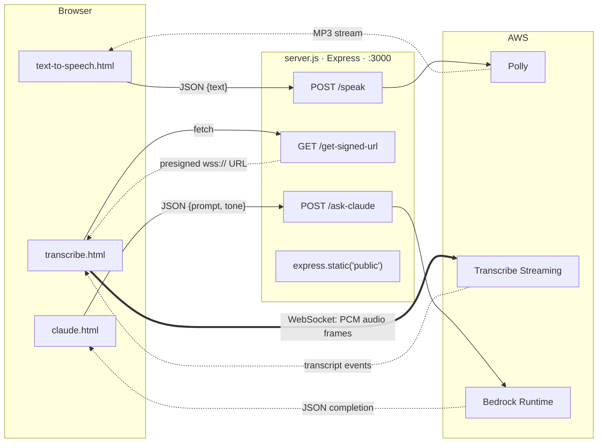
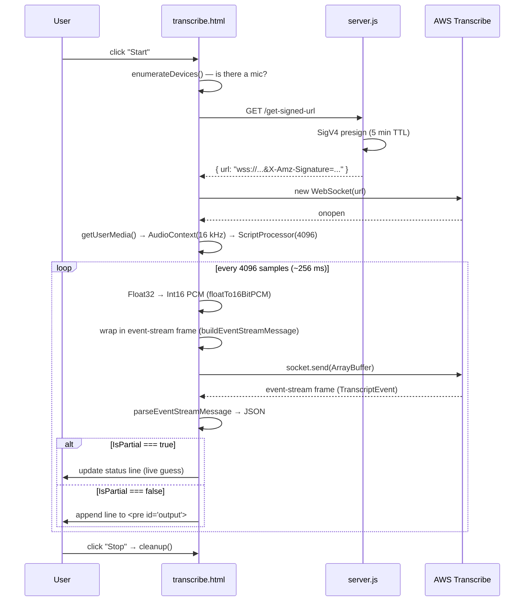

# 01 — What this app does, and how it is built

**Audience:** an engineer who has never opened this repo before.
**Goal:** after reading this you should be able to trace any request end to end,
know where every line of code lives, and know what is currently broken.

---

## 1. The one-paragraph summary

`nova-bpt` is a **demo harness for three AWS AI services**. A small Express
server holds the AWS credentials and does one of three things for the browser:
call Polly to turn text into speech, mint a short-lived signed URL so the
browser can stream microphone audio directly to Transcribe, or call Claude on
Bedrock and hand back the reply. The front end is three standalone HTML files
with inline `<script>` tags — no framework, no bundler, no npm packages in the
browser at all.

The value of the design is that it is **completely transparent**: there are no
abstractions between you and the AWS SDK. The cost is that everything is
hand-rolled, including a full binary-protocol encoder in `transcribe.html`.

---

## 2. Repository map

```
nova-bpt/
├── server.js              # THE ENTIRE BACKEND (221 lines)
├── package.json           # deps + `npm run dev` / `npm start`
├── README.md              # setup + IAM troubleshooting
├── .gitignore             # node_modules, /.env
├── fabledocs/             # you are here
└── public/                # served statically by express.static
    ├── text-to-speech.html   #  ~40 lines. Textarea → /speak → <audio>
    ├── claude.html           #  ~35 lines. Textarea → /ask-claude → <span>
    └── transcribe.html       # ~570 lines. The complex one. Mic → WebSocket → AWS
```

Things that do **not** exist and that you should not go looking for: a database,
a test suite, a `src/` directory, TypeScript, a router module, controllers,
services, middleware beyond `cors()` + `express.json()`, environment-specific
config, CI, or a Dockerfile.

There is also a small inconsistency worth knowing: `package.json` declares
`"main": "index.js"`, but no `index.js` exists — the real entry point is
`server.js`, which is what both npm scripts run. `main` is unused here because
nothing imports this package, so it is cosmetic, but it is misleading.

---

## 3. The architecture, in one diagram



The important structural insight: **two different trust patterns coexist here.**

- `/speak` and `/ask-claude` are a **proxy**. The browser never touches AWS. The
  server holds the credentials, makes the call, and relays the result.
- `/get-signed-url` is a **credential broker**. The server signs a URL and hands
  it over; the browser then talks to AWS *directly* over a WebSocket, with the
  server completely out of the loop.

The broker pattern exists because Transcribe streaming is a long-lived
bidirectional connection — proxying it would mean the server relaying every
4096-sample audio chunk. Handing the browser a signed URL is simpler and
lower-latency. The tradeoff is that anyone who can reach `/get-signed-url` gets
five minutes of direct, unmetered access to your AWS Transcribe account. That is
fine on localhost and a genuine problem in production — see
[STORY-04](./02-user-stories.md#story-04--lock-down-cors-and-add-rate-limiting).

---

## 4. `server.js` walkthrough

Read the file top to bottom; it is short and has no indirection.

### 4.1 Bootstrap (lines 1–32)

```js
require('dotenv').config()          // loads .env into process.env
const AWS_APP_ID     = process.env.AWS_APP_ID
const AWS_APP_SECRET = process.env.AWS_APP_SECRET
const region         = process.env.REGION

if (!AWS_APP_ID || !AWS_APP_SECRET || !region) {
  console.error("AWS credentials or region missing");
  throw new Error("AWS credentials not configured properly");
}

app.use(cors());
app.use(express.json());
app.use(express.static('public'));
```

Three notes:

1. The `throw` at module scope means a missing variable crashes the process on
   boot with a stack trace. That is arguably correct (fail fast), but the error
   does not say *which* variable is missing.
2. `cors()` with no options sets `Access-Control-Allow-Origin: *`. Any website
   on the internet can call these endpoints from a visitor's browser and spend
   your AWS budget.
3. `express.static('public')` resolves relative to the **process working
   directory**, not to `server.js`. Start the server from anywhere other than
   the repo root and the static files silently 404. Prefer
   `express.static(path.join(__dirname, 'public'))`.

### 4.2 `POST /speak` — Polly (lines 34–62)

```js
const polly = new PollyClient({ credentials: {...}, region });   // per request!
const { text } = req.body;
const command = new SynthesizeSpeechCommand({
  OutputFormat: "mp3", Text: text, TextType: "text",
  VoiceId: "Matthew", Engine: "generative",
});
const response = await polly.send(command);
res.set({ 'Content-Type': 'audio/mpeg', ... });
response.AudioStream.pipe(res);              // stream straight through
```

`AudioStream` is a Node `Readable`, so `.pipe(res)` streams the MP3 to the
browser without buffering it in memory. That part is good.

What is hardcoded: the voice (`Matthew`), the engine (`generative`), the format
(`mp3`), and the text type (`text`, i.e. no SSML). There is also no input
validation — an empty body means `text` is `undefined` and Polly rejects it with
a 500 that says nothing useful. Polly's hard limit is 3000 billed characters per
`SynthesizeSpeech` call; nothing here guards against that.

The `new PollyClient(...)` inside the handler builds a fresh client, credential
resolver and HTTP agent on **every request**. Hoisting it to module scope is a
one-line change and lets the SDK reuse connections
([STORY-03](./02-user-stories.md#story-03--hoist-aws-clients-to-module-scope)).

### 4.3 `GET /get-signed-url` + `getSignedWebSocketUrl()` — Transcribe (lines 64–154)

This is the most subtle endpoint. It builds an `HttpRequest` describing the
WebSocket handshake, signs it with SigV4 in *presign* mode, and returns the
resulting URL as JSON.

```js
const request = new HttpRequest({
  protocol: "wss",
  hostname: `transcribestreaming.${region}.amazonaws.com`,
  port: 8443,
  method: "GET",
  path: "/stream-transcription-websocket",
  query: { "language-code": "en-US", "media-encoding": "pcm",
           "sample-rate": "16000", "session-id": sessionId,
           "content-identification-type": "PII", /* ...more... */ },
  headers: { host: `${hostname}:8443`, /* x-amzn-transcribe-* */ },
});

const signer = new SignatureV4({ credentials, region, service: "transcribe",
                                 sha256: Sha256, applyChecksum: false });

const signed = await signer.presign(request, {
  expiresIn: 300,                              // 5 minutes
  unsignableHeaders: new Set([...])            // see below
});
return formatUrl(signed);
```

Things a junior engineer will trip over here:

- **`service: "transcribe"`** — not `"transcribestreaming"`. The signing service
  name and the hostname prefix differ. Getting this wrong produces an opaque
  403 on WebSocket connect.
- **`unsignableHeaders`** — the `x-amzn-transcribe-*` headers are included in
  the request object so the SDK builds the right shape, but a browser
  `WebSocket` cannot send custom headers. If they were signed, the signature
  would never match what the browser actually sends, so they are explicitly
  excluded from the signature and the equivalent query-string parameters do the
  real work.
- **`expiresIn: 300`** — the URL is dead after five minutes. Since the browser
  fetches it immediately before connecting, that is plenty, but a reconnect
  after a long pause needs a fresh URL.
- The manually set `x-amz-date` header is redundant. `presign()` sets
  `X-Amz-Date` in the query string itself; the header does not survive.
- The `session-id` is generated with a hand-rolled `Math.random()` UUID v4
  template. `crypto.randomUUID()` is built into Node 22 and does the same thing
  correctly in one call.

### 4.4 `POST /ask-claude` — Bedrock (lines 156–211)

```js
const modelId = 'anthropic.claude-3-sonnet-20240229-v1:0';
const params = {
  modelId,
  contentType: 'application/json',
  accept: 'application/json',
  body: JSON.stringify({
    anthropic_version: 'bedrock-2023-05-31',
    max_tokens: 1024,
    system: req.body.tone ?? '',
    messages: JSON.parse(req.body.prompt ?? ''),   // ⚠️ see §6.1
  }),
};
const response = await bedrock.send(new InvokeModelCommand(params));
const responseBody = JSON.parse(Buffer.from(response.body).toString());
res.json({ completion: responseBody.content[0].text });
```

This is the raw Bedrock `InvokeModel` path: you hand-assemble the Anthropic
Messages API request body as a JSON string, and hand-parse the response bytes
back out. `anthropic_version: 'bedrock-2023-05-31'` is the wire-format version
Bedrock requires in the body — it is not the model version.

Note the shape of the response: `responseBody.content` is an **array of content
blocks**, and the code assumes `content[0]` is a text block. That is true for a
plain text reply, but it is a load-bearing assumption.

The model, `anthropic.claude-3-sonnet-20240229-v1:0`, dates from early 2024 and
is several generations behind.
[STORY-08](./02-user-stories.md#story-08--upgrade-to-a-current-claude-model-via-the-bedrock-mantle-client)
covers the upgrade path.

The commented-out block above this handler (lines 165–185) is an earlier attempt
that used the legacy `prompt: "\n\nHuman: ... \n\nAssistant:"` completion format
and an inference-profile ARN. It is dead code — delete it rather than working
around it.

---

## 5. The front end

### 5.1 `text-to-speech.html` and `claude.html`

Both are ~40 lines and follow the same shape: a `<textarea>`, a `<button
onclick="...">`, an output element, and one `async function` that `fetch`es the
API. Neither has any CSS. `text-to-speech.html` turns the MP3 response into a
blob URL and points an `<audio>` element at it:

```js
const audioBlob = await response.blob();
player.src = URL.createObjectURL(audioBlob);
player.play();
```

(`URL.createObjectURL` allocates a blob URL that lives until the page unloads or
you call `URL.revokeObjectURL`. Repeated use leaks memory — minor here,
worth knowing.)

`claude.html` has no error handling beyond `data.completion || "Error."`, so a
500 renders as the word "Error." with no detail.

### 5.2 `transcribe.html` — the interesting one

570 lines, and the only file with real complexity. The flow:



Four helper functions carry the weight:

| Function | Lines | Job |
| --- | --- | --- |
| `floatTo16BitPCM` | 445–453 | Web Audio gives `Float32Array` in `[-1, 1]`. Transcribe wants signed 16-bit little-endian integers. Clamps, scales by `0x8000`/`0x7FFF`, writes with `DataView.setInt16(…, true)`. |
| `buildEventStreamMessage` | 456–502 | Wraps a PCM chunk in AWS's binary event-stream frame. Writes the prelude, prelude CRC32, three headers, the payload, then the message CRC32. |
| `parseEventStreamMessage` | 523–551 | The inverse. Reads the prelude, walks the header block, slices out the JSON payload. Throws on any header whose value type is not `7` (string). |
| `crc32` + `crc32Table` | 505–520 | Standard CRC-32 (polynomial `0xEDB88320`), table built once at load. AWS validates both CRCs and drops frames that fail. |

#### Concept 1: SigV4 presigning (why `/get-signed-url` exists)

Every AWS API call must be signed with your secret key. You cannot ship the
secret key to a browser. **Presigning** solves this: the server computes a
signature over the request it wants to authorise, embeds that signature in the
URL's query string, and hands the URL over. Whoever holds the URL can make
*that one request* until `expiresIn` elapses — and nothing else. That is why the
signed URL has `X-Amz-Signature`, `X-Amz-Credential`, `X-Amz-Date`, and
`X-Amz-Expires` glued onto it.

#### Concept 2: the AWS event-stream binary format

Transcribe streaming does not speak plain JSON over the WebSocket. Every message
in both directions is a binary frame laid out like this:

```
┌────────────────┬──────────────────┬──────────────┬─────────┬─────────┬──────────────┐
│ total length   │ headers length   │ prelude CRC  │ headers │ payload │ message CRC  │
│ 4 bytes (BE)   │ 4 bytes (BE)     │ 4 bytes      │ N bytes │ M bytes │ 4 bytes      │
└────────────────┴──────────────────┴──────────────┴─────────┴─────────┴──────────────┘
```

Each header is `[nameLen:u8][name][valueType:u8][valueLen:u16 BE][value]`.
Outbound audio frames carry three headers — `:content-type`,
`:event-type: AudioEvent`, `:message-type: event`. Inbound frames carry
`:event-type: TranscriptEvent` with a JSON payload.

Everything here is **big-endian** except the PCM samples inside the payload,
which are **little-endian**. Mixing those up is the classic bug in this code
path.

#### Concept 3: partial vs final results

Transcribe emits its running best guess continuously. `IsPartial: true` means
"this will change" — the current code writes it into the status line.
`IsPartial: false` means "this is settled" — the code appends it to the output
`<pre>`. That is the right split, though the partial display is cramped into a
status string rather than shown inline
([STORY-15](./02-user-stories.md#story-15--inline-partial-results-and-language-selection)).

---

## 6. Known issues

Ordered roughly by severity. Each maps to a story in
[02-user-stories.md](./02-user-stories.md).

### 6.1 — `/ask-claude` is broken from the UI

**Severity: critical.**

`claude.html:28` sends the textarea contents as a raw string:

```js
body: JSON.stringify({ prompt: input })     // input === "what is 2+2"
```

`server.js:197` parses that string as JSON:

```js
messages: JSON.parse(req.body.prompt ?? '')
```

Verified against Node 22:

```
""                                 => THROWS: Unexpected end of JSON input
"hello"                            => THROWS: Unexpected token 'h', ... is not valid JSON
'[{"role":"user","content":"hi"}]' => OK
```

So every request from the browser throws inside the `try` block, gets caught,
and returns `500 {"error": "Error calling Claude"}` — the page renders
"Error.". The only way to get a response today is to type a raw JSON messages
array into the textarea. This regressed in commit `f8dba37`, which changed the
server to expect a pre-built messages array without updating the page.
Fixed by [STORY-01](./02-user-stories.md#story-01--fix-the-broken-ask-claude-contract).

### 6.2 — Wide-open CORS on credential-backed endpoints

**Severity: high, before any deployment.** `app.use(cors())` allows any origin. Combined with `/get-signed-url` handing out
direct AWS access with no authentication and no rate limit, a single link click
can drain a budget. ([STORY-04](./02-user-stories.md#story-04--lock-down-cors-and-add-rate-limiting))

### 6.3 — Async `onaudioprocess` handler can reorder audio

**Severity: high, low frequency.** `transcribe.html:280` is `async`, and awaits `resampleTo16kHz` before sending:

```js
processor.onaudioprocess = async e => {
  if (audioContext.sampleRate !== 16000) {
    input = await resampleTo16kHz(input, audioContext.sampleRate);   // ⚠️
  }
  socket.send(buildEventStreamMessage(floatTo16BitPCM(input)));
};
```

`onaudioprocess` fires on a fixed cadence and does not wait for the previous
promise. If two callbacks are ever in flight, their `socket.send()` calls can
land out of order, which corrupts the transcript. The `AudioContext` is
constructed with `sampleRate: 16000`, so in practice the branch rarely runs —
but "rarely" is the worst kind of bug.
([STORY-14](./02-user-stories.md#story-14--fix-the-async-resampling-race))

### 6.4 — Deprecated `ScriptProcessorNode`

`createScriptProcessor` has been deprecated for years and runs audio processing
on the **main thread**, so a busy UI causes dropouts. `AudioWorklet` is the
replacement. ([STORY-13](./02-user-stories.md#story-13--migrate-to-audioworklet))

### 6.5 — A client is constructed on every request

`new PollyClient(...)` and `new BedrockRuntimeClient(...)` live inside their
handlers. ([STORY-03](./02-user-stories.md#story-03--hoist-aws-clients-to-module-scope))

### 6.6 — Outdated Claude model

`anthropic.claude-3-sonnet-20240229-v1:0` is from February 2024.
([STORY-08](./02-user-stories.md#story-08--upgrade-to-a-current-claude-model-via-the-bedrock-mantle-client))

### 6.7 — No tests, no env example, no health check

`npm test` currently exits 1 with "Error: no test specified". A new engineer has
to reverse-engineer the required environment variables from `server.js`.
(Stories [02](./02-user-stories.md#story-02--configuration-module-and-env-example)
and [19](./02-user-stories.md#story-19--test-suite-and-health-check))

### 6.8 — `nodemon` is a runtime dependency

It is in `dependencies`, not `devDependencies`, so `npm install --production`
still pulls it and its transitive tree into a deployment image.

### 6.9 — Duplicated navigation and inconsistent styling

The same three-link `<nav>` is copy-pasted into all three pages. Only
`transcribe.html` has CSS; the other two are unstyled browser defaults.
([STORY-20](./02-user-stories.md#story-20--shared-ui-shell-and-accessibility-pass))

---

## 7. Where to add code

If you are about to write something, this is roughly where it belongs given the
current structure. Do not build a `src/controllers/services/repositories` tree
for a 220-line server — but do split when a file crosses ~300 lines.

| You are adding… | Put it in… |
| --- | --- |
| A new API endpoint | `server.js` for now. Once there are >5 routes, split into `routes/*.js`. |
| AWS client setup | Module scope in `server.js`, or a `lib/aws.js` once there are more than two. |
| Anything reading `process.env` | `config.js` (created in [STORY-02](./02-user-stories.md#story-02--configuration-module-and-env-example)) — nothing else should touch `process.env`. |
| A new demo page | `public/<name>.html`, plus a nav link in the shared shell. |
| Shared browser JS | `public/js/<name>.js`, loaded with a plain `<script src>`. Do not add a bundler. |
| Shared CSS | `public/css/app.css` (created in [STORY-20](./02-user-stories.md#story-20--shared-ui-shell-and-accessibility-pass)). |
| Tests | `test/*.test.js` (created in [STORY-19](./02-user-stories.md#story-19--test-suite-and-health-check)). |

## 8. Conventions in this codebase

Match what is already there rather than importing your own preferences:

- **CommonJS** (`require`), not ESM. `package.json` has no `"type": "module"`.
- **Double quotes** in `server.js`, mixed in the HTML files. Not enforced by a
  linter.
- **`async/await`** everywhere, with `try/catch` in each handler.
- **Errors** are logged with `console.error("<context>:", err)` and answered
  with `res.status(500).json({ error: "<human message>" })`. Internal messages
  are never leaked to the client — keep it that way.
- **No comments explaining what the next line does.** The existing comments mark
  non-obvious constraints (`// Must be 16kHz for AWS Transcribe`). Follow that.
