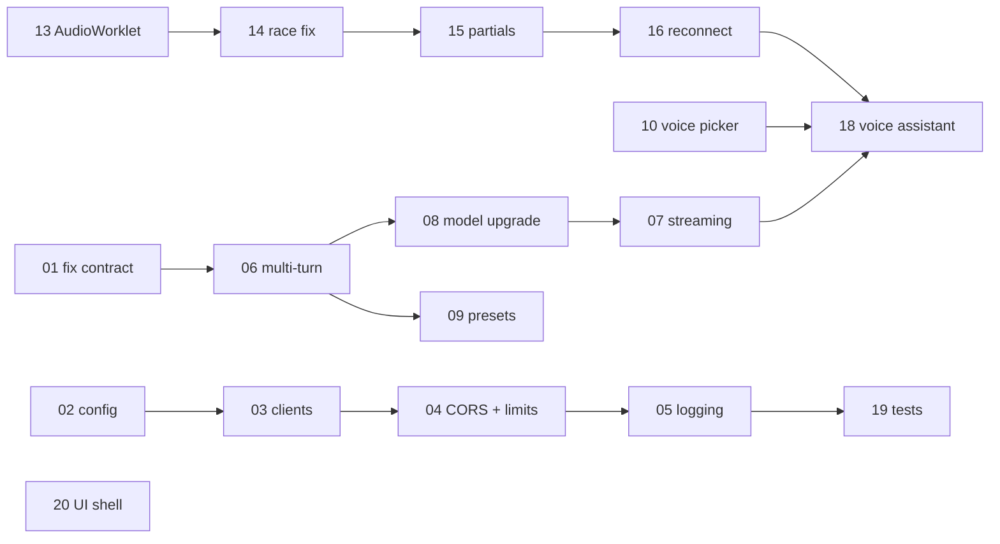

# 02 — Backlog: 20 user stories

Written to be picked up cold. Every story states the user value, the acceptance
criteria you will be judged against, the technical detail you would otherwise
have to discover the hard way, and the files you will touch.

Read [01-architecture.md](./01-architecture.md) first.

## How to read a story

- **Size** — S ≈ half a day, M ≈ 1–2 days, L ≈ 3–5 days. Rough, not a contract.
- **Depends on** — merge those first; this story assumes their code exists.
- **Out of scope** — deliberately excluded. Do not gold-plate; open a follow-up.
- **Definition of done** applies to every story in addition to its own criteria:
  the app starts with `npm run dev`, all three pages load without console
  errors, no secret is committed, and `git diff` contains nothing unrelated to
  the story.

## The epics

| Epic | Stories | Theme |
| --- | --- | --- |
| A — Stabilise | 01–05 | Fix what is broken and make the server safe to run. **Do these first.** |
| B — Make Claude a real chat | 06–09 | Turn a one-shot textarea into a usable assistant. |
| C — Speech synthesis | 10–12 | Give the Polly page real controls and stop overpaying. |
| D — Live transcription | 13–17 | Modernise and harden the audio pipeline. |
| E — Tie it together | 18–20 | The integrated demo, plus tests and a shared UI. |

### Suggested delivery order



---

# Epic A — Stabilise

## STORY-01 — Fix the broken /ask-claude contract

> **As a** visitor to the Ask Claude page
> **I want** to type a plain question and get an answer
> **so that** the page does something other than print "Error."

**Size:** S · **Priority:** P0 · **Depends on:** nothing

### Context

Commit `f8dba37` changed the server to expect `req.body.prompt` to be a
*JSON-encoded messages array*, but `public/claude.html` still sends the raw
textarea string. `JSON.parse("what is 2+2")` throws, the `catch` returns a 500,
and the page shows "Error.". See
[§6.1 of the architecture doc](./01-architecture.md#61--ask-claude-is-broken-from-the-ui)
for the verified reproduction. **The page is 100% broken today** — this is the
first thing to fix.

### Acceptance criteria

1. Typing `What is 2+2?` into the textarea and clicking Ask renders Claude's
   answer in the page.
2. The server accepts `POST /ask-claude` with body
   `{ "message": "<string>", "tone": "<string, optional>" }` and builds the
   Anthropic messages array itself. **The browser never sends JSON-encoded
   JSON.**
3. Submitting an empty or whitespace-only message returns `400` with
   `{ "error": "message is required" }` and the page shows that message. It does
   not call Bedrock.
4. A message longer than 8000 characters returns `400` with a clear error.
5. When Bedrock fails, the page shows "Something went wrong — check the server
   logs", not the raw error. The server logs the real error with `console.error`.
6. The Ask button is disabled and reads "Thinking…" while a request is in
   flight, then re-enables — including on failure.
7. The commented-out dead code at `server.js:165-185` is deleted.

### Technical notes

Server side, replace the `JSON.parse` line:

```js
const { message, tone } = req.body ?? {};

if (typeof message !== 'string' || message.trim() === '') {
  return res.status(400).json({ error: 'message is required' });
}
if (message.length > 8000) {
  return res.status(400).json({ error: 'message must be 8000 characters or fewer' });
}

const body = {
  anthropic_version: 'bedrock-2023-05-31',
  max_tokens: 1024,
  messages: [{ role: 'user', content: message }],
};
if (typeof tone === 'string' && tone.trim() !== '') {
  body.system = tone;          // omit the field entirely when empty
}
```

Send `system` only when it is non-empty — an empty-string system prompt is
pointless and some model versions reject it.

Keep the response shape `{ completion: "..." }` so you only have to change one
line in the HTML. Guard the response parse: `content` is an array of blocks, so
find the first block with `type === 'text'` rather than assuming index 0.

Browser side, in `claude.html`:

```js
body: JSON.stringify({ message: input })
```

and read `res.ok` before parsing so a 400/500 shows its `error` field.

### Files

`server.js`, `public/claude.html`

### Out of scope

Multi-turn history (STORY-06), streaming (STORY-07), the model upgrade
(STORY-08). Fix the contract, nothing else.

---

## STORY-02 — Configuration module and env example

> **As a** new engineer cloning this repo
> **I want** a documented list of required environment variables and a clear
> error when one is missing
> **so that** I am not reverse-engineering `process.env` reads from a stack trace.

**Size:** S · **Priority:** P0 · **Depends on:** nothing

### Context

There is no `.env.example`. `server.js:22-25` throws a generic
`"AWS credentials not configured properly"` without saying which of the three
variables is absent, and it does so via a bare `throw` at module scope.

### Acceptance criteria

1. `.env.example` exists at the repo root, is committed, lists every variable
   with a comment and a safe placeholder, and contains **no real credentials**.
2. A new `config.js` module reads and validates all environment variables and
   exports a frozen config object. **No other file reads `process.env`.**
3. Starting the server with a missing variable prints a single actionable line
   naming *every* missing variable, then exits with code 1 — no stack trace:
   ```
   Missing required environment variables: AWS_APP_SECRET, REGION
   Copy .env.example to .env and fill in the values.
   ```
4. `PORT` is configurable via environment, defaulting to `3000`.
5. `README.md`'s setup section points at `.env.example` instead of listing the
   variables inline.

### Technical notes

```js
// config.js
require('dotenv').config();

const REQUIRED = ['AWS_APP_ID', 'AWS_APP_SECRET', 'REGION'];
const missing = REQUIRED.filter((k) => !process.env[k]);

if (missing.length > 0) {
  console.error(`Missing required environment variables: ${missing.join(', ')}`);
  console.error('Copy .env.example to .env and fill in the values.');
  process.exit(1);
}

module.exports = Object.freeze({
  awsAppId: process.env.AWS_APP_ID,
  awsAppSecret: process.env.AWS_APP_SECRET,
  region: process.env.REGION,
  port: Number(process.env.PORT) || 3000,
});
```

`process.exit(1)` rather than `throw` gives a clean message. Note that this
means `config.js` cannot be imported by a test that does not have a `.env` —
STORY-19 will want an escape hatch, so keep the validation in an exported
function if that turns out to be awkward.

`.gitignore` already covers `/.env`. Verify `.env` is not tracked before you
commit: `git ls-files --error-unmatch .env` should fail.

### Files

`config.js` (new), `.env.example` (new), `server.js`, `README.md`

---

## STORY-03 — Hoist AWS clients to module scope

> **As** an operator
> **I want** AWS SDK clients created once at startup
> **so that** connections are reused and per-request latency drops.

**Size:** S · **Priority:** P1 · **Depends on:** STORY-02

### Context

`new PollyClient(...)` (`server.js:35`) and `new BedrockRuntimeClient(...)`
(`server.js:157`) run inside their request handlers. Each call rebuilds the
credential resolver, HTTP agent, and middleware stack, and prevents TCP/TLS
connection reuse.

### Acceptance criteria

1. Exactly one `PollyClient` and one `BedrockRuntimeClient` are constructed, at
   module load.
2. Both read credentials and region from `config.js`.
3. Both endpoints still work — synthesise speech, and ask Claude a question.
4. Two consecutive `/speak` requests measurably reuse the connection (observe it
   with `AWS_NODEJS_CONNECTION_REUSE_ENABLED=1` and a timing log, or just note
   the reduced p50 in the story's PR description).

### Technical notes

```js
const credentials = { accessKeyId: config.awsAppId, secretAccessKey: config.awsAppSecret };
const polly = new PollyClient({ credentials, region: config.region });
const bedrock = new BedrockRuntimeClient({ credentials, region: config.region });
```

AWS SDK v3 clients are thread-safe and designed to be long-lived singletons —
this is the intended usage, not an optimisation hack.

### Files

`server.js`

---

## STORY-04 — Lock down CORS and add rate limiting

> **As** the person who owns the AWS bill
> **I want** these endpoints usable only by our own front end, at a bounded rate
> **so that** a shared link cannot drain the account.

**Size:** M · **Priority:** P0 (before any deployment) · **Depends on:** STORY-02

### Context

`app.use(cors())` sets `Access-Control-Allow-Origin: *`. Worse,
`GET /get-signed-url` hands out five minutes of **direct, unauthenticated AWS
Transcribe access** to anyone who asks. There is no rate limit anywhere. This is
acceptable on localhost and unacceptable anywhere else.

### Acceptance criteria

1. CORS is driven by an `ALLOWED_ORIGINS` config value (comma-separated). When
   unset, it defaults to `http://localhost:3000` only.
2. A request from a disallowed origin is rejected; the same-origin front end
   continues to work.
3. Every `/speak`, `/get-signed-url`, and `/ask-claude` request is rate limited
   per IP. Defaults: 30/min for `/speak` and `/ask-claude`, 10/min for
   `/get-signed-url`. All three limits are configurable.
4. Exceeding a limit returns `429` with `{ "error": "Too many requests" }` and a
   `Retry-After` header.
5. `express.json()` is capped at `{ limit: '64kb' }`.
6. The signed URL's `expiresIn` drops from 300 s to 60 s. The browser fetches it
   immediately before connecting, so 60 s is ample and it shrinks the window in
   which a leaked URL is useful.
7. `README.md` gains a short "Security posture" section stating plainly that
   there is no user authentication and that this app must not be exposed to the
   public internet as-is.

### Technical notes

```bash
npm install express-rate-limit
```

```js
const cors = require('cors');
const rateLimit = require('express-rate-limit');

app.use(cors({ origin: config.allowedOrigins }));   // array of strings

const limiter = (max) => rateLimit({
  windowMs: 60_000,
  max,
  standardHeaders: true,
  legacyHeaders: false,
  message: { error: 'Too many requests' },
});

app.post('/speak', limiter(config.limits.speak), speakHandler);
app.get('/get-signed-url', limiter(config.limits.signedUrl), signedUrlHandler);
app.post('/ask-claude', limiter(config.limits.askClaude), askClaudeHandler);
```

If you deploy behind a proxy or load balancer, set `app.set('trust proxy', 1)`
or every request will appear to come from the proxy's IP and share one bucket.

Rate limiting is a speed bump, not authentication. Real auth is a separate,
larger story — note it in the README rather than half-building it here.

### Files

`server.js`, `config.js`, `README.md`, `package.json`

### Out of scope

User accounts, API keys, sessions, OAuth.

---

## STORY-05 — Structured logging and a single error handler

> **As** an engineer debugging a failed request
> **I want** every request and error to carry a correlation ID
> **so that** I can connect a user's report to the exact log lines.

**Size:** M · **Priority:** P2 · **Depends on:** STORY-02

### Context

Logging today is `console.log` / `console.error` with ad-hoc prefixes, and every
handler repeats the same `try/catch → res.status(500).json(...)` block. Nothing
ties a client-visible failure to a server log line.

### Acceptance criteria

1. Every request logs one line on completion with: request ID, method, path,
   status, and duration in ms.
2. Every response carries an `X-Request-Id` header. If the client sent one, it
   is echoed; otherwise the server generates one.
3. Errors log at `error` level with the request ID, the message, and the stack.
4. A single Express error-handling middleware produces all 5xx responses, in the
   shape `{ "error": "<safe message>", "requestId": "<id>" }`. **No stack trace
   or AWS error detail ever reaches the client.**
5. Handlers no longer contain `res.status(500)` — they `throw` or call
   `next(err)` and let the middleware answer. (`/speak` is the exception: once
   `AudioStream.pipe(res)` has started, headers are already sent, so it must
   check `res.headersSent` and destroy the response instead.)
6. Log level is configurable via `LOG_LEVEL`, defaulting to `info`.

### Technical notes

`pino` plus `pino-http` is the least-ceremony option and gives you request IDs
for free:

```bash
npm install pino pino-http
```

```js
const pinoHttp = require('pino-http');
app.use(pinoHttp({ level: config.logLevel }));
// then inside handlers: req.log.error({ err }, 'Polly synthesis failed');
```

The error middleware **must** take four arguments or Express will not recognise
it, and it **must** be registered after all routes:

```js
app.use((err, req, res, next) => {
  req.log.error({ err }, 'Unhandled error');
  if (res.headersSent) return next(err);
  res.status(err.status ?? 500).json({
    error: err.expose ? err.message : 'Internal server error',
    requestId: req.id,
  });
});
```

Express 5 (which this project uses) forwards rejected promises from async
handlers to the error middleware automatically — you do not need
`express-async-errors`.

### Files

`server.js`, `config.js`, `package.json`

---

# Epic B — Make Claude a real chat

## STORY-06 — Multi-turn conversation with history

> **As a** user of the Ask Claude page
> **I want** the assistant to remember what we already said
> **so that** I can ask follow-up questions instead of restating context.

**Size:** M · **Priority:** P1 · **Depends on:** STORY-01

### Context

Every request today is a single-turn `[{ role: 'user', content: ... }]`. Claude
has no memory of the previous exchange, which makes the page a toy.

### Acceptance criteria

1. The page shows a scrolling transcript of the conversation, with user and
   assistant turns visually distinguished, newest at the bottom.
2. Sending a follow-up ("and what about in Spanish?") produces an answer that
   correctly uses the earlier context.
3. `POST /ask-claude` accepts
   `{ "messages": [{ "role": "user"|"assistant", "content": "<string>" }, …],
   "tone": "<string, optional>" }`.
4. The server **validates** the array before calling Bedrock and returns `400`
   with a specific message when: it is empty, it is not an array, any role is
   not `user` or `assistant`, any content is not a non-empty string, or the
   first message is not `user`.
5. History is capped: if the array exceeds 40 messages, the server keeps the most
   recent 40 while ensuring the first kept message has role `user`.
6. A total-characters cap (50 000 across all messages) returns `400` rather than
   sending an oversized request to Bedrock.
7. A "New conversation" button clears the transcript and the client-side history.
8. Assistant replies render as Markdown (headings, lists, `code`, fenced blocks)
   rather than raw text, and each assistant turn has a copy-to-clipboard button.
9. Conversation state lives in the browser only. **The server stays stateless.**

### Technical notes

Keep the array in a module-level `let messages = []` in the page script. After a
successful response, push both the user turn and the assistant turn. On failure,
**do not** push the user turn — otherwise a retry duplicates it.

The Anthropic Messages API requires the first message to be `user`; consecutive
same-role messages are allowed and get merged into one turn, so you do not need
strict alternation.

For Markdown, do **not** add a bundler. Vendor a single-file renderer into
`public/js/` or write a deliberately minimal renderer covering fenced code,
inline code, bold, italic, links, and lists. **Whatever you choose, escape HTML
before rendering** — model output is untrusted input as far as the DOM is
concerned. Never assign model text to `innerHTML` unescaped.

### Files

`server.js`, `public/claude.html`, `public/js/` (new)

### Out of scope

Server-side persistence, multiple saved conversations, streaming (STORY-07).

---

## STORY-07 — Stream Claude's response

> **As a** user asking a long question
> **I want** to see the answer appear as it is generated
> **so that** the page does not sit blank for ten seconds.

**Size:** L · **Priority:** P1 · **Depends on:** STORY-06, STORY-08

### Context

`InvokeModelCommand` waits for the entire response before returning anything.
With a higher `max_tokens` that is a long, silent wait, and it risks HTTP
timeouts.

### Acceptance criteria

1. Text appears in the transcript incrementally, within ~1 s of sending.
2. `POST /ask-claude` streams to the browser using Server-Sent Events, with
   `Content-Type: text/event-stream`, `Cache-Control: no-cache`, and
   `Connection: keep-alive`.
3. Event protocol, one JSON object per SSE `data:` line:
   - `{"type":"delta","text":"…"}` — append this text
   - `{"type":"done","stopReason":"…"}` — turn complete
   - `{"type":"error","message":"…"}` — failure; the UI shows it and re-enables input
4. Closing the browser tab mid-stream aborts the upstream Bedrock call rather
   than leaving it running (listen for `req.on('close')`).
5. A "Stop" button appears during generation; clicking it aborts the stream and
   keeps whatever text has arrived so far as a complete assistant turn.
6. Partial text that arrived before an error is preserved, not discarded.
7. If any earlier non-streaming client still posts to the endpoint, it gets a
   clear error rather than a broken response — pick the mode from an `Accept`
   header or a `?stream=1` query parameter and document the choice.

### Technical notes

With the Anthropic Bedrock SDK client from STORY-08:

```js
const stream = client.messages.stream({
  model: config.claudeModelId,
  max_tokens: 64000,          // streaming, so give it room
  system: tone || undefined,
  messages,
});

for await (const event of stream) {
  if (event.type === 'content_block_delta' && event.delta.type === 'text_delta') {
    res.write(`data: ${JSON.stringify({ type: 'delta', text: event.delta.text })}\n\n`);
  }
}
const final = await stream.finalMessage();
res.write(`data: ${JSON.stringify({ type: 'done', stopReason: final.stop_reason })}\n\n`);
res.end();
```

Every SSE message must end with a **blank line** (`\n\n`) or the browser buffers
it forever. This is the single most common bug in a first SSE implementation.

On the browser side, `EventSource` only does GET. Since we need to POST a
messages array, read the response body with `fetch` + `ReadableStream` instead:

```js
const res = await fetch('/ask-claude', { method: 'POST', /* … */, signal: controller.signal });
const reader = res.body.pipeThrough(new TextDecoderStream()).getReader();
let buffer = '';
for (;;) {
  const { value, done } = await reader.read();
  if (done) break;
  buffer += value;
  const chunks = buffer.split('\n\n');
  buffer = chunks.pop();                    // keep the incomplete tail
  for (const chunk of chunks) { /* strip "data: ", JSON.parse, dispatch */ }
}
```

Buffer across reads — a chunk boundary can land in the middle of an SSE frame.
Use an `AbortController` for the Stop button and for tab-close cleanup.

If you have not done STORY-08 yet, the raw equivalent is
`InvokeModelWithResponseStreamCommand`, whose `response.body` is an async
iterable of chunks each containing a base64 `bytes` field to decode and parse.
It is materially more code — do STORY-08 first.

### Files

`server.js`, `public/claude.html`, `public/js/`

---

## STORY-08 — Upgrade to a current Claude model via the Bedrock Mantle client

> **As a** user
> **I want** answers from a current-generation model
> **so that** quality and capability match what the rest of the industry ships.

**Size:** M · **Priority:** P1 · **Depends on:** STORY-01, STORY-03

### Context

The app pins `anthropic.claude-3-sonnet-20240229-v1:0` — a February 2024 model,
several generations old. It also hand-assembles the request body as a JSON
string and hand-parses the response bytes, which is exactly the boilerplate the
official SDK removes.

### Acceptance criteria

1. The app calls Claude through `@anthropic-ai/bedrock-sdk`'s
   `AnthropicBedrockMantle` client instead of raw
   `InvokeModelCommand` + `JSON.stringify`/`JSON.parse`.
2. The model ID is `anthropic.claude-opus-5` and lives in `config.js` as
   `CLAUDE_MODEL_ID`, defaulted in code and overridable by environment.
3. `max_tokens` is raised from 1024 to **16000** for non-streaming requests.
   (STORY-07 raises it to 64000 for streaming.)
4. `anthropic_version`, the manual body `JSON.stringify`, and the manual
   `Buffer.from(response.body)` parse are all gone.
5. Asking a question still returns a correct answer through the existing page.
6. `README.md` documents the Bedrock prerequisite: model access must be enabled
   for Claude in the Bedrock console **for your region**, and current-generation
   models on Bedrock generally require a cross-region inference profile. If the
   call returns `AccessDeniedException` or `ValidationException`, that is the
   first thing to check — it is a console setting, not a code bug.

### Technical notes

```bash
npm install @anthropic-ai/bedrock-sdk
```

```js
const { AnthropicBedrockMantle } = require('@anthropic-ai/bedrock-sdk');
const client = new AnthropicBedrockMantle({ awsRegion: config.region });

const response = await client.messages.create({
  model: config.claudeModelId,          // "anthropic.claude-opus-5"
  max_tokens: 16000,
  system: tone || undefined,
  messages,
});
const text = response.content.find((b) => b.type === 'text')?.text ?? '';
```

**Credentials:** the Bedrock client resolves credentials through the standard
AWS chain (`AWS_ACCESS_KEY_ID` / `AWS_SECRET_ACCESS_KEY` / `AWS_REGION`, shared
profile, instance role). This repo uses non-standard variable names
(`AWS_APP_ID` / `AWS_APP_SECRET`), so either export the standard names in
`config.js` before constructing the client, or add the standard names to
`.env.example` and migrate. **Pick one and document it** — do not guess at
constructor options.

**Request-shape changes on current models.** These return a `400` if you carry
them over from older code:

- `temperature`, `top_p`, `top_k` are **removed**. Steer with prompting instead.
- `thinking: { type: "enabled", budget_tokens: N }` is **removed**. Use
  `thinking: { type: "adaptive" }`, and control depth with
  `output_config: { effort: "low" | "medium" | "high" | "xhigh" | "max" }`.
- Assistant-turn prefills (a trailing `{ role: 'assistant' }` message) are
  **rejected**. Use structured outputs or a system-prompt instruction.
- On Opus 5, **thinking is on by default** — omitting the `thinking` field runs
  adaptive thinking. `max_tokens` caps thinking *plus* response text together,
  which is the real reason criterion 3 raises it. `thinking: { type: "disabled" }`
  is only accepted at effort `high` or below.

**Not available on Bedrock** — do not reach for these: the Files API, Message
Batches, task budgets, web search / web fetch, and server-side code execution.
Prompt caching, streaming, tool use, vision, and effort all work.

**Alternative worth a spike:** *Claude Platform on AWS* (`@anthropic-ai/aws-sdk`,
`new AnthropicAws()`) is Anthropic-operated with same-day feature parity and
**bare** model IDs (`claude-opus-5`, no `anthropic.` prefix). It needs
`AWS_REGION` and `ANTHROPIC_AWS_WORKSPACE_ID` and still authenticates with
SigV4, so the existing credentials carry over. If the missing Bedrock features
matter later, this is the migration path — timebox a spike, do not fold it into
this story.

### Files

`server.js`, `config.js`, `.env.example`, `package.json`, `README.md`

---

## STORY-09 — System-prompt presets

> **As a** user
> **I want** to pick how the assistant behaves
> **so that** I can get a terse answer, a detailed explanation, or a code review
> without retyping instructions.

**Size:** S · **Priority:** P2 · **Depends on:** STORY-06

### Context

The server already accepts a `tone` field and passes it as the system prompt,
but nothing in the UI ever sets it, so it is always empty. The plumbing exists;
the controls do not.

### Acceptance criteria

1. A dropdown above the input offers at least: Default, Concise, Detailed
   explainer, Code reviewer, and Custom.
2. Choosing Custom reveals a textarea for a free-form system prompt.
3. The chosen preset is sent as `tone` and visibly changes the answer's style.
4. Presets are defined in one place — `public/js/presets.js` — as
   `{ id, label, systemPrompt }` objects, so adding one is a single edit.
5. The selection persists across page reloads via `localStorage`.
6. Changing the preset mid-conversation applies from the next message on;
   existing turns are untouched.
7. A custom prompt longer than 4000 characters is rejected client-side with a
   message, before any request is sent.

### Technical notes

The system prompt goes in the top-level `system` field, **not** as a message
with `role: "system"` in the array. Send `system: undefined` (omit it entirely)
for the Default preset rather than an empty string.

Suggested starting prompts:

```js
concise:  "Answer in at most three sentences. No preamble, no caveats, no restating the question."
detailed: "Explain thoroughly for someone new to the topic. Define jargon on first use and give a worked example."
reviewer: "You are a senior code reviewer. Identify correctness bugs first, then " +
          "clarity issues. Quote the specific line. Do not comment on formatting."
```

Note that changing the system prompt mid-conversation invalidates any prompt
cache, so cost per message rises briefly. Not a blocker at this scale — worth
knowing.

### Files

`public/claude.html`, `public/js/presets.js` (new)

---

# Epic C — Speech synthesis

## STORY-10 — Voice and engine picker driven by DescribeVoices

> **As a** user of the Text-to-Speech page
> **I want** to choose the voice and language
> **so that** I am not stuck with one American male voice.

**Size:** M · **Priority:** P1 · **Depends on:** STORY-03

### Context

`server.js:47-48` hardcodes `VoiceId: "Matthew"` and `Engine: "generative"`.
Polly offers dozens of voices across many languages, and not every voice
supports every engine — asking for a generative-only voice on the standard
engine (or vice versa) is an error.

### Acceptance criteria

1. A new `GET /voices` endpoint returns the available voices as
   `[{ id, name, languageCode, languageName, gender, supportedEngines: [...] }]`.
2. The page populates a language dropdown and a voice dropdown; changing the
   language filters the voice list.
3. An engine dropdown offers only the engines the **selected voice** actually
   supports. Selecting a voice that does not support the current engine
   auto-corrects the engine rather than erroring.
4. `POST /speak` accepts `{ text, voiceId, engine }`. All three are validated;
   an unknown `voiceId` or `engine` returns `400`.
5. Omitting `voiceId`/`engine` falls back to the current defaults (`Matthew`,
   `generative`) so nothing that exists today breaks.
6. The voice list is fetched once and cached in memory for 24 hours — it changes
   rarely and every call costs a Polly API request.
7. The last-used voice, language, and engine persist in `localStorage`.

### Technical notes

```js
const { DescribeVoicesCommand } = require('@aws-sdk/client-polly');
const { Voices } = await polly.send(new DescribeVoicesCommand({ IncludeAdditionalLanguageCodes: true }));
```

Each voice object has `Id`, `Name`, `LanguageCode`, `LanguageName`, `Gender`,
and `SupportedEngines` (an array containing some of `standard`, `neural`,
`long-form`, `generative`). **Drive the engine dropdown from
`SupportedEngines`** — do not hardcode the list.

Validate `voiceId` against the cached list server-side. Never pass a
client-supplied string straight to the AWS SDK.

Engine choice affects both price and quality: `standard` is cheapest,
`generative` is the most natural and most expensive. Surface that as helper
text so users understand the tradeoff.

### Files

`server.js`, `public/text-to-speech.html`

---

## STORY-11 — SSML input mode and audio download

> **As a** user
> **I want** to control pauses, emphasis, and pronunciation, and save the result
> **so that** I can produce usable audio rather than a one-off preview.

**Size:** M · **Priority:** P2 · **Depends on:** STORY-10

### Context

`TextType` is pinned to `"text"`, so SSML markup is read aloud as literal
angle-bracket text. There is also no way to keep the audio — it lives in a blob
URL that dies with the page.

### Acceptance criteria

1. A Text / SSML toggle sets `TextType` accordingly.
2. In SSML mode, the server verifies the input is wrapped in a single `<speak>`
   root element and returns `400` with a clear message if not.
3. Malformed SSML surfaces Polly's own error message (it is user-facing and
   genuinely helpful here), not a generic 500.
4. A "Download MP3" button saves the current audio with a filename derived from
   the first few words of the text, e.g. `hello-this-is-a-browser.mp3`.
5. A help panel documents the four most useful tags with copyable examples:
   `<break time="500ms"/>`, `<emphasis level="strong">`, `<prosody rate="slow">`,
   `<say-as interpret-as="digits">`.
6. Character count and Polly's 3000-billed-character limit are shown live; the
   Speak button disables past the limit.
7. Blob URLs are revoked with `URL.revokeObjectURL` when replaced, so repeated
   synthesis does not leak memory.

### Technical notes

Not every SSML tag works on every engine — the generative and neural engines
support a narrower set than standard. When the request fails, echo Polly's
`InvalidSsmlException` message straight through; it names the offending tag.

For download, either add `?download=1` to the request so the server sets
`Content-Disposition: attachment; filename="…"`, or do it entirely client-side:

```js
const a = document.createElement('a');
a.href = audioUrl;
a.download = filename;
a.click();
```

Client-side is simpler and avoids a second synthesis call. Sanitise the derived
filename: lowercase, strip everything but `[a-z0-9-]`, collapse runs of hyphens,
cap at 40 characters, fall back to `speech.mp3` if the result is empty.

### Files

`server.js`, `public/text-to-speech.html`

---

## STORY-12 — Cache synthesised audio

> **As** the person who owns the AWS bill
> **I want** identical synthesis requests served from cache
> **so that** repeated demos of the same sentence are not billed every time.

**Size:** M · **Priority:** P2 · **Depends on:** STORY-10

### Context

Polly bills per character synthesised, and the generative engine is the most
expensive tier. Demoing the same sentence twenty times bills twenty times.

### Acceptance criteria

1. `/speak` computes a cache key from `sha256(text + voiceId + engine + outputFormat)`.
2. A cache hit returns the stored MP3 without calling Polly.
3. Responses carry `ETag: "<hash>"` and `Cache-Control: public, max-age=86400`.
   A conditional request with a matching `If-None-Match` returns `304`.
4. The cache is bounded — at most 200 entries or 50 MB, whichever comes first,
   evicting least-recently-used.
5. Cache hits and misses are logged, and `GET /health` (STORY-19) reports
   `{ entries, bytes, hits, misses }`.
6. `CACHE_ENABLED=false` disables it entirely for debugging.
7. A cached response is byte-identical to a fresh one — verified by a test.

### Technical notes

An in-memory `Map` is fine and correct for this app: single process, no
horizontal scaling, restart-tolerant. Do not add Redis.

Buffer the MP3 to store it — which conflicts with today's `AudioStream.pipe(res)`
streaming path. Collect the stream into a `Buffer`, store it, then
`res.end(buffer)`. Given Polly's 3000-character cap the payloads are small
(hundreds of KB), so buffering is acceptable; note the tradeoff in a comment.

```js
const chunks = [];
for await (const chunk of response.AudioStream) chunks.push(chunk);
const audio = Buffer.concat(chunks);
```

For LRU, either write ~30 lines using a `Map` (JS `Map` preserves insertion
order — `delete` then `set` on access moves an entry to the end, and
`map.keys().next().value` gives you the oldest) or add the `lru-cache` package.
Either is defensible; the hand-rolled version avoids a dependency.

### Files

`server.js`, `config.js`, `test/cache.test.js`

---

# Epic D — Live transcription

## STORY-13 — Migrate to AudioWorklet

> **As a** user transcribing while the page is busy
> **I want** audio capture to keep up
> **so that** words are not dropped when the UI does work.

**Size:** L · **Priority:** P1 · **Depends on:** nothing

### Context

`transcribe.html:258` uses `createScriptProcessor`, deprecated for years. It
runs on the **main thread**, so any UI work — rendering transcript lines,
garbage collection — can starve audio processing and drop samples.
`AudioWorklet` runs on the dedicated audio thread and is the supported
replacement.

### Acceptance criteria

1. Audio capture uses `AudioWorkletNode`; `createScriptProcessor` is gone.
2. Transcription accuracy and latency are no worse than before — verify by
   reading the same paragraph aloud on both versions and diffing the output.
3. The worklet converts Float32 → Int16 PCM **inside the worklet** and posts
   `ArrayBuffer`s to the main thread; the main thread only frames and sends.
4. Buffering matches today's behaviour: post roughly every 4096 samples
   (≈256 ms at 16 kHz), not on every 128-frame render quantum.
5. Transcription still works after Stop → Start without a page reload; the
   worklet module is added once and reused.
6. If `audioWorklet` is unavailable, the page shows "Your browser does not
   support audio capture — please use a current Chrome, Edge, Firefox, or
   Safari" rather than failing silently.
7. The debug panel still logs sample rate, buffer size, and PCM byte counts.

### Technical notes

New file `public/js/pcm-worklet.js`:

```js
class PCMProcessor extends AudioWorkletProcessor {
  constructor() {
    super();
    this.buffer = new Int16Array(4096);
    this.offset = 0;
  }

  process(inputs) {
    const channel = inputs[0]?.[0];
    if (!channel) return true;                 // no input yet — stay alive

    for (let i = 0; i < channel.length; i++) {
      const s = Math.max(-1, Math.min(1, channel[i]));
      this.buffer[this.offset++] = s < 0 ? s * 0x8000 : s * 0x7fff;
      if (this.offset === this.buffer.length) {
        const out = this.buffer.slice();        // copy — we keep reusing this.buffer
        this.port.postMessage(out.buffer, [out.buffer]);   // transfer, no copy
        this.offset = 0;
      }
    }
    return true;                                // false would terminate the node
  }
}
registerProcessor('pcm-processor', PCMProcessor);
```

Main thread:

```js
await audioContext.audioWorklet.addModule('/js/pcm-worklet.js');
const node = new AudioWorkletNode(audioContext, 'pcm-processor');
node.port.onmessage = ({ data }) => {
  if (socket?.readyState === WebSocket.OPEN) socket.send(buildEventStreamMessage(data));
};
source.connect(node);
```

Four things that will bite you:

- **`process()` must return `true`.** Returning `false` tells the browser the
  node is finished and it is torn down.
- The worklet module is fetched over HTTP, so `express.static` must serve it and
  `addModule` needs an absolute path (`/js/pcm-worklet.js`).
- Do not `postMessage` `this.buffer` directly — you keep writing into it. Copy
  with `.slice()`, then transfer the copy's `ArrayBuffer`.
- You no longer need `node.connect(audioContext.destination)`. The old code did
  that only because `ScriptProcessorNode` required a connected output to fire —
  and it also risked routing the mic to the speakers.

### Files

`public/js/pcm-worklet.js` (new), `public/transcribe.html`

---

## STORY-14 — Fix the async resampling race

> **As a** user on a device whose audio hardware will not run at 16 kHz
> **I want** my audio delivered in order
> **so that** the transcript is not scrambled.

**Size:** S · **Priority:** P1 · **Depends on:** STORY-13

### Context

`transcribe.html:280` declares the audio callback `async` and `await`s
`resampleTo16kHz` before sending. The callback fires on a fixed cadence and does
not wait for the previous promise, so two in-flight callbacks can `socket.send()`
out of order. See
[§6.3 of the architecture doc](./01-architecture.md#63--async-onaudioprocess-handler-can-reorder-audio).

The resample also allocates a fresh `OfflineAudioContext` per chunk, roughly
four times a second, which is expensive for what it does.

### Acceptance criteria

1. Audio chunks reach the socket in strict capture order under all conditions.
2. The per-chunk `OfflineAudioContext` allocation is gone.
3. On a device that cannot honour `sampleRate: 16000`, transcription still
   works and produces a correct transcript.
4. The debug panel logs the actual `AudioContext.sampleRate` at startup and
   states clearly whether resampling is active.
5. If a device is genuinely unsupported, the user sees an explicit message
   rather than a silently garbled transcript.

### Technical notes

Preferred fix — **do not resample at all.** After STORY-13, request the rate you
need and read back what you got:

```js
audioContext = new AudioContext({ sampleRate: 16000 });
if (audioContext.sampleRate !== 16000) {
  // The browser refused. Tell Transcribe the truth instead of resampling:
  // pass the actual rate in the presign request and let AWS handle it.
}
```

The cleanest handling of a refused rate is to make the sample rate a **parameter
of the signed URL**: `GET /get-signed-url?sampleRate=44100`, with the server
validating it against Transcribe's supported values (8000–48000) and setting
both `sample-rate` and `media-sample-rate-hertz` in the query. AWS then does the
resampling for you and there is no client-side race to fix.

If for some reason you must resample in the browser, make it **synchronous** —
linear interpolation over the sample array is a dozen lines and adds no
meaningful error at these rates. Never `await` inside an audio callback.

### Files

`public/transcribe.html`, `public/js/pcm-worklet.js`, `server.js`

---

## STORY-15 — Inline partial results and language selection

> **As a** user speaking into the page
> **I want** to see my words appear live in place, in my own language
> **so that** the feature feels responsive and is usable outside English.

**Size:** M · **Priority:** P2 · **Depends on:** STORY-13

### Context

Partial results are written into a small `#status` line (`transcribe.html:372`)
while finals accumulate in `<pre id="output">`, so the live text is visually
disconnected from the transcript. The language is hardcoded `en-US` in the
presign query (`server.js:103`).

### Acceptance criteria

1. Partial text renders at the bottom of the transcript, visually distinct
   (greyed or italic), and is **replaced in place** as it updates.
2. When a result arrives with `IsPartial: false`, the partial line is promoted
   to a normal transcript line and the partial area clears.
3. A language dropdown offers at least `en-US`, `en-GB`, `es-US`, `fr-CA`,
   `de-DE`, and `ja-JP`, and is disabled while a session is running.
4. `GET /get-signed-url` accepts `?languageCode=…`, validates it against an
   allow-list, and returns `400` for anything else. Omitting it keeps `en-US`.
5. `#status` reverts to connection state only ("Ready", "Connecting…",
   "Transcribing…", "Stopped") — never transcript text.
6. The transcript auto-scrolls to the bottom, **unless** the user has scrolled
   up, in which case a "Jump to latest" button appears.
7. The transcript region is an ARIA live region so screen readers announce final
   lines (`aria-live="polite"`).

### Technical notes

Render the partial in a separate element that you overwrite wholesale, rather
than appending:

```js
if (result.IsPartial) {
  partialEl.textContent = transcript;
} else {
  appendFinalLine(transcript);
  partialEl.textContent = '';
}
```

Never `+=` a partial — it will duplicate text, because each partial is the full
current utterance, not a delta.

`aria-live="polite"` on the *partial* element would make a screen reader announce
every keystroke-level update. Put the live region on the finals container only.

Note the existing `content-identification-type: PII` query parameter: Transcribe
will flag PII entities in results, but nothing in the UI surfaces that today.
Either display the flags or drop the parameter — leaving it on while ignoring
the output is misleading. Also note PII identification is not supported for every
language, so validate the combination.

### Files

`server.js`, `public/transcribe.html`

---

## STORY-16 — Session resilience: reconnect and refresh the signed URL

> **As a** user transcribing a long meeting
> **I want** the session to survive a brief network blip
> **so that** I do not lose the transcript to a dropped WebSocket.

**Size:** M · **Priority:** P2 · **Depends on:** STORY-15

### Context

`socket.onclose` calls `cleanup()` and stops (`transcribe.html:396-400`). Any
drop — a Wi-Fi handoff, a laptop sleep, an idle timeout — ends the session, and
because the presigned URL expires after 300 s (60 s after STORY-04), the old URL
cannot be reused. There is also no graceful end-of-stream signal, so the last
utterance may never be finalised.

### Acceptance criteria

1. An unexpected close while the user has not pressed Stop triggers automatic
   reconnection: fetch a **fresh** signed URL, open a new socket, resume sending.
2. Reconnection uses exponential backoff (1 s, 2 s, 4 s, 8 s) and gives up after
   4 attempts with a clear message.
3. Transcript text from before the drop is preserved. Reconnecting starts a new
   Transcribe session, so a brief gap in audio is expected — mark it in the
   transcript with a `— reconnected —` separator rather than pretending it is
   continuous.
4. Pressing Stop closes cleanly and does **not** trigger reconnection.
5. On Stop, an empty-payload `AudioEvent` frame is sent before closing, so
   Transcribe finalises the last utterance instead of discarding it.
6. Status text distinguishes "Reconnecting (attempt 2 of 4)…" from
   "Transcribing…" and from "Connection lost".
7. The WebSocket close code and reason are logged to the debug panel for every
   close.

### Technical notes

Track intent with a flag so `onclose` can tell the two cases apart:

```js
let stoppedByUser = false;
stopButton.onclick = () => { stoppedByUser = true; sendEndOfStream(); cleanup(); };

socket.onclose = (e) => {
  logDebug(`WebSocket closed: ${e.code} ${e.reason}`);
  if (!stoppedByUser) scheduleReconnect();
};
```

The end-of-stream signal is an event-stream frame with the same three headers as
a normal `AudioEvent` but a **zero-length payload**. Your existing
`buildEventStreamMessage` already handles that — pass `new ArrayBuffer(0)`.

Do not reuse the old signed URL on reconnect. Even inside its TTL it is tied to
a `session-id`; get a fresh one from `/get-signed-url`. This is also why
STORY-04's shortened expiry is safe — the URL is always fetched immediately
before use.

Watch for a reconnect loop when the *cause* is a bad configuration (an expired
credential, a revoked IAM permission) rather than a network blip: closes with
code `1008`/`1011` and an auth-shaped reason should fail fast rather than retry
four times.

### Files

`public/transcribe.html`

---

## STORY-17 — Export and copy the transcript

> **As a** user who has just transcribed something
> **I want** to save or copy the text
> **so that** the work does not vanish when I close the tab.

**Size:** S · **Priority:** P2 · **Depends on:** STORY-15

### Context

The transcript exists only as text content in a `<pre>` element. Refresh the
page and it is gone.

### Acceptance criteria

1. A "Copy transcript" button copies the full final transcript to the clipboard
   and confirms with a transient "Copied" state.
2. A "Download .txt" button saves the transcript as
   `transcript-YYYY-MM-DD-HHmm.txt`.
3. A "Clear" button empties the transcript, with a confirmation step when it is
   non-empty.
4. An optional "Include timestamps" checkbox prefixes each final line with
   `[HH:MM:SS]` elapsed from session start, in both the on-screen transcript and
   the export.
5. All three buttons are disabled when the transcript is empty.
6. The transcript survives an accidental reload: it is written to
   `sessionStorage` on each final result and restored on load, with a "Restored
   from previous session" notice and a dismiss option.

### Technical notes

`navigator.clipboard.writeText()` requires a secure context — it works on
`localhost` and HTTPS but **not** over plain HTTP to another host. Feature-detect
and fall back to selecting the text and prompting the user to press Ctrl+C.

For the download, build a blob and revoke the URL afterwards:

```js
const blob = new Blob([text], { type: 'text/plain;charset=utf-8' });
const url = URL.createObjectURL(blob);
// …create <a>, set download, click…
URL.revokeObjectURL(url);
```

Use `sessionStorage`, not `localStorage` — a transcript may contain sensitive
speech and should not outlive the browser tab. Note the ~5 MB quota and handle
`QuotaExceededError` by dropping the oldest lines rather than throwing.

### Files

`public/transcribe.html`

---

# Epic E — Tie it together

## STORY-18 — Voice assistant: speak → transcribe → Claude → Polly

> **As a** user
> **I want** to talk to Claude and hear it answer
> **so that** the three services in this app become one product instead of three
> disconnected demos.

**Size:** L · **Priority:** P1 · **Depends on:** STORY-07, STORY-10, STORY-16

### Context

The app has speech-to-text, an LLM, and text-to-speech, on three separate pages
that never talk to each other. Wiring them into one loop is the highest-value
feature available, and it needs no new AWS services.

### Acceptance criteria

1. A new page `public/assistant.html` presents a single push-to-talk control.
2. The full loop works: hold to speak → live partial captions → release →
   final transcript becomes the user turn → Claude's answer streams in as text
   → the answer is spoken aloud via Polly.
3. Conversation history is maintained across turns (reuse STORY-06's logic).
4. Every turn is shown as text as well as spoken — the page is fully usable
   with audio muted.
5. Speech synthesis begins before the full answer arrives: buffer streamed text
   and synthesise **sentence by sentence** so playback starts within ~2 s of the
   first token.
6. Sentence audio plays in order, with no gaps or overlaps, even when a later
   sentence's synthesis finishes before an earlier one's.
7. Barge-in: pressing the talk control while the assistant is speaking stops
   playback immediately and starts listening.
8. A visible state machine — Idle / Listening / Thinking / Speaking — with each
   state distinguishable without relying on colour alone.
9. Any stage failing (mic denied, transcribe drop, Bedrock error, Polly error)
   returns the page to Idle with a specific message. The loop never wedges.
10. A mute toggle suppresses TTS while leaving the text conversation working.

### Technical notes

This is an orchestration story — nearly all the pieces exist. Extract the
transcription pipeline from `transcribe.html` into `public/js/transcriber.js`
and the chat call into `public/js/chat.js` first, then compose them. Resist
copy-pasting 500 lines into a fourth page.

Model the flow as an explicit state machine. Ad-hoc booleans (`isListening`,
`isSpeaking`, `isThinking`) will produce impossible states — for example both
listening and speaking after a fast barge-in.

```
idle ──talk down──▶ listening ──talk up──▶ thinking ──first sentence──▶ speaking
  ▲                     │                     │                            │
  └─────────────────────┴──── error ──────────┴───── done / barge-in ──────┘
```

For sentence-by-sentence synthesis, accumulate streamed deltas and flush on a
sentence boundary (`/[.!?]\s/`) or after ~200 characters, whichever comes first —
otherwise a long list without terminal punctuation never flushes. Then maintain
an **audio queue**: kick off synthesis requests as sentences complete (they run
concurrently), but play strictly in submission order. An array of promises that
you `await` in order gives you both.

Barge-in needs `audioElement.pause()`, clearing the queue, **and** aborting
in-flight Polly requests via `AbortController` — otherwise a synthesis that was
already in flight will start playing over the user.

Push-to-talk avoids voice-activity detection entirely. Keep it that way for this
story; hands-free VAD is a much larger problem.

### Files

`public/assistant.html` (new), `public/js/transcriber.js` (new),
`public/js/chat.js` (new), `public/js/speaker.js` (new), `public/transcribe.html`,
`public/claude.html`

### Out of scope

Wake words, voice activity detection, speaker diarisation, interrupting Claude
mid-sentence with a correction.

---

## STORY-19 — Test suite and health check

> **As** an engineer changing this code
> **I want** automated tests and a health endpoint
> **so that** I can refactor without manually clicking through three pages.

**Size:** M · **Priority:** P1 · **Depends on:** STORY-02, STORY-05

### Context

`npm test` exits 1 with `Error: no test specified`. There is no way to verify a
change other than starting the server and clicking. Note that `server.js:221`
already has `// module.exports = app;` commented out — someone started down this
path.

### Acceptance criteria

1. `npm test` runs a real suite and exits 0 on a clean checkout **without AWS
   credentials** — every AWS call is stubbed.
2. `server.js` exports the Express `app`; `app.listen` runs only when the file
   is the entry point (`if (require.main === module)`).
3. Endpoint tests cover, at minimum:
   - `POST /ask-claude` rejects an empty message with 400
   - `POST /ask-claude` rejects a malformed messages array with 400
   - `POST /ask-claude` returns the completion on a stubbed Bedrock success
   - `POST /speak` rejects empty text with 400
   - `POST /speak` returns `audio/mpeg` on a stubbed Polly success
   - `GET /get-signed-url` returns a URL containing `X-Amz-Signature`
   - an unknown route returns 404
   - a 500 response never contains a stack trace
4. Unit tests cover the pure helpers: `floatTo16BitPCM` (known input → known
   bytes, including clamping at ±1 and the asymmetric `0x8000`/`0x7FFF` scale),
   `crc32` against a published test vector, and
   `buildEventStreamMessage` → `parseEventStreamMessage` round-tripping.
5. `GET /health` returns `200` with `{ status, uptime, version, region }` and
   makes **no AWS calls**, so it is safe as a load-balancer probe.
6. The suite runs in under 10 seconds.
7. `README.md` documents how to run tests and how to add one.

### Technical notes

Node 22 ships a test runner — no framework dependency needed:

```bash
npm install --save-dev supertest
```

```json
"scripts": { "test": "node --test test/" }
```

```js
const { test } = require('node:test');
const assert = require('node:assert');
const request = require('supertest');
const app = require('../server');

test('POST /ask-claude rejects an empty message', async () => {
  const res = await request(app).post('/ask-claude').send({ message: '' });
  assert.strictEqual(res.status, 400);
});
```

For stubbing AWS, `aws-sdk-client-mock` is purpose-built for SDK v3:

```js
const { mockClient } = require('aws-sdk-client-mock');
const pollyMock = mockClient(PollyClient);
pollyMock.on(SynthesizeSpeechCommand).resolves({ AudioStream: Readable.from([Buffer.from('fake')]) });
```

The browser helpers (`floatTo16BitPCM`, `crc32`, `buildEventStreamMessage`) are
currently trapped inside a `<script>` tag in `transcribe.html` and cannot be
imported. Move them to `public/js/audio-utils.js` and load it with a plain
`<script src>`; expose them on `window` for the page and add a
`module.exports` guarded by `typeof module !== 'undefined'` for the tests. Keep
it simple — do not introduce a bundler to make testing work.

### Files

`server.js`, `test/*.test.js` (new), `public/js/audio-utils.js` (new),
`public/transcribe.html`, `package.json`, `README.md`

---

## STORY-20 — Shared UI shell and accessibility pass

> **As a** user — including one using a keyboard or a screen reader
> **I want** consistent, navigable pages
> **so that** the app feels like one product and is usable by everyone.

**Size:** M · **Priority:** P2 · **Depends on:** nothing

### Context

The same three-link `<nav>` is copy-pasted into all three pages. Only
`transcribe.html` has any CSS; the other two are raw browser defaults. Nothing
indicates the current page. Buttons use inline `onclick`, there are no `<label>`
elements, and status updates are invisible to screen readers.

### Acceptance criteria

1. `public/css/app.css` holds all shared styling; `transcribe.html`'s inline
   `<style>` block is migrated into it.
2. Navigation is defined once in `public/js/nav.js` and injected into every
   page; adding a page means editing one array.
3. The current page's nav link is visually marked and carries
   `aria-current="page"`.
4. All four pages (including `assistant.html` if STORY-18 has landed) share the
   same header, spacing, typography, and button styling.
5. Every form control has an associated `<label>`; every icon-only button has an
   `aria-label`.
6. Every interactive element is reachable and operable by keyboard, in a sensible
   tab order, with a visible focus indicator.
7. Status messages use `role="status"` / `aria-live="polite"` so they are
   announced. Errors use `role="alert"`.
8. Text contrast meets WCAG AA (4.5:1). The existing `#4285f4` on white and
   `#666` status text both need checking.
9. Layout is usable at 360 px wide — no horizontal scrolling.
10. A `prefers-color-scheme: dark` variant exists and is legible.
11. Inline `onclick` attributes are replaced with `addEventListener` in each
    page's script.
12. `axe` DevTools (or Lighthouse's accessibility audit) reports zero critical
    issues on every page.

### Technical notes

No bundler and no framework. The nav injection is deliberately small:

```js
// public/js/nav.js
const PAGES = [
  { href: '/assistant.html',      label: 'Voice Assistant' },
  { href: '/text-to-speech.html', label: 'Text to Speech' },
  { href: '/transcribe.html',     label: 'Live Transcription' },
  { href: '/claude.html',         label: 'Ask Claude' },
];

document.addEventListener('DOMContentLoaded', () => {
  const here = location.pathname;
  document.querySelector('[data-nav]').innerHTML = PAGES.map(({ href, label }) =>
    `<a href="${href}"${href === here ? ' aria-current="page"' : ''}>${label}</a>`
  ).join('');
});
```

That is the one place `innerHTML` is acceptable — the content is a hardcoded
constant, not user or model input.

Use CSS custom properties for the palette so the dark variant is an override of
`:root` values rather than a duplicated stylesheet.

Do not remove `transcribe.html`'s debug panel. It is genuinely useful; just
style it consistently and make its toggle button reflect state with
`aria-expanded`.

### Files

`public/css/app.css` (new), `public/js/nav.js` (new), all files in `public/`

---

## Appendix — deliberately not in this backlog

Named so nobody wastes time re-proposing them, with the reasoning:

| Idea | Why not now |
| --- | --- |
| User accounts / auth | Real need before any public deployment, but it is its own epic and would dwarf everything here. Ship STORY-04 and keep the app private in the meantime. |
| A database | Nothing needs server-side persistence yet. `localStorage` / `sessionStorage` cover the current stories. Revisit if saved conversations become a requirement. |
| React / Vue / a bundler | Four pages of vanilla JS. A build step would cost more than it returns at this size. Revisit past ~10 pages or when shared state gets painful. |
| TypeScript | Defensible, but a migration touching every file competes with shipping features. If you want type safety cheaply, add JSDoc annotations plus `checkJs`. |
| Docker / IaC | Worth doing at deployment time, driven by the actual target platform. Premature until one is chosen. |
| Speaker diarisation | Transcribe supports it (`show-speaker-labels`, currently `false`), but it needs real UI design for multi-speaker transcripts. Separate story once single-speaker is solid. |
| Anthropic Managed Agents | Not available on Amazon Bedrock. Would require moving to the first-party Claude API or Claude Platform on AWS first — see STORY-08's spike note. |
