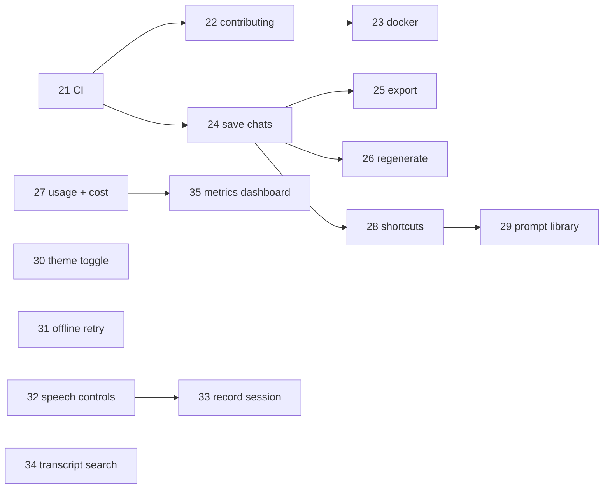

# 03 — Backlog: 15 more user stories (21–35)

> **Status: all fifteen are delivered**, each through its own pull request.
> This repository is a snapshot of the merged result and has no pull requests
> of its own; the PRs live in the canonical repo
> [elirc/3build-nova](https://github.com/elirc/3build-nova/pulls?q=is%3Apr)
> (story 21 → PR #1 … story 35 → PR #15; #16 fixed the CI runner on Node 20).
> The same merges appear here in `git log`. This document is kept as the
> record of what each story was judged against — the reasoning behind each
> implementation is in the PR that delivered it.

The second wave, written after the v2 app in [`../app`](../app) shipped. Stories
01–20 are in [02-user-stories.md](./02-user-stories.md) and are all delivered.

These are **ordered for delivery, not by theme**. Epic F comes first on purpose:
a junior engineer should have CI, a PR template, and a reproducible container
before piling on features, so that every later pull request arrives with a green
check and a consistent description.

Read the same conventions as before: **Size** S ≈ half a day, M ≈ 1–2 days,
L ≈ 3–5 days. **Depends on** must merge first. **Out of scope** is deliberate.

| Epic | Stories | Theme |
| --- | --- | --- |
| F — Engineering foundations | 21–23 | CI, contribution workflow, containers. Do these first. |
| G — Conversation power tools | 24–27 | Make a chat something you can keep, revisit, and afford. |
| H — Input and control | 28–31 | Speed and resilience for people who use it daily. |
| I — Speech | 32–33 | Control how the assistant sounds, and keep a copy. |
| J — Transcription and observability | 34–35 | Find things in a transcript; see what the app is costing. |



---

# Epic F — Engineering foundations

## STORY-21 — Continuous integration with GitHub Actions

> **As a** reviewer
> **I want** every pull request to run the test suite automatically
> **so that** I am reviewing the design, not checking whether it still works.

**Size:** S · **Priority:** P0 · **Depends on:** nothing

### Context

`app/` has 51 tests that run offline in about five seconds, but nothing runs
them except a human remembering to. A pull request with a red suite currently
looks identical to one with a green suite.

### Acceptance criteria

1. `.github/workflows/ci.yml` runs on every push to `main` and every pull
   request targeting `main`.
2. The job installs with `npm ci` (not `npm install`) and runs `npm test` inside
   `app/`.
3. The matrix covers Node 20 and Node 22, so we find out before a user does that
   we depend on something version-specific.
4. `npm ci` requires a committed lockfile; confirm `app/package-lock.json` is
   tracked.
5. The dependency cache is keyed on the lockfile hash so unchanged dependencies
   are not re-downloaded on every run.
6. A deliberately broken test makes the check fail — verify this once by pushing
   a throwaway branch, then revert it.
7. A second job runs `npm audit --audit-level=high` and reports findings without
   failing the build. Security noise should be visible, not blocking.
8. The workflow has `permissions: contents: read` — the default token is far
   broader than this job needs.
9. `app/README.md` gains a CI status badge.

### Technical notes

```yaml
name: CI
on:
  push: { branches: [main] }
  pull_request: { branches: [main] }
permissions:
  contents: read
jobs:
  test:
    runs-on: ubuntu-latest
    strategy:
      fail-fast: false          # see BOTH versions fail, not just the first
      matrix:
        node: ['20', '22']
    defaults:
      run: { working-directory: app }
    steps:
      - uses: actions/checkout@v4
      - uses: actions/setup-node@v4
        with:
          node-version: ${{ matrix.node }}
          cache: npm
          cache-dependency-path: app/package-lock.json
      - run: npm ci
      - run: npm test
```

`defaults.run.working-directory` applies to `run:` steps only — `setup-node`
needs its own `cache-dependency-path` because it is an action, not a shell step.
That asymmetry catches people out.

Pin actions to a major version (`@v4`). Floating on `@main` means a third party
can change what runs in your pipeline without a commit on your side.

### Files

`.github/workflows/ci.yml` (new), `app/README.md`

### Out of scope

Deployment, release automation, coverage thresholds, and linting — STORY-22
covers the human side of the workflow, and a linter is worth its own story.

---

## STORY-22 — Contributor guide, PR template, and issue templates

> **As a** new engineer opening my first pull request
> **I want** the project to tell me what a good change looks like
> **so that** I am not guessing at commit style or what reviewers expect.

**Size:** S · **Priority:** P0 · **Depends on:** STORY-21

### Context

The repository has no stated convention for branch names, commit messages, or
what a pull request should explain. That knowledge currently lives only in
whoever reviewed the last change.

### Acceptance criteria

1. `CONTRIBUTING.md` documents, with a worked example of each:
   - branch naming (`feat/24-save-conversations`, `fix/…`, `chore/…`, `docs/…`)
   - Conventional Commits, including when to use which type and why the body
     should explain **why** rather than **what**
   - the local loop: `npm ci`, `npm test`, then open a PR
   - the review expectation: small PRs, one concern each, self-review first
2. `.github/pull_request_template.md` prompts for: what changed, why, how it was
   tested, the story it closes, and anything the reviewer should look at hardest.
3. Issue templates for a bug report and a feature request live in
   `.github/ISSUE_TEMPLATE/`.
4. `CONTRIBUTING.md` explains **why** the conventions exist, not just what they
   are. A rule a junior does not understand is a rule they will drop under
   pressure.
5. A short "how to review someone else's PR" section: read the description
   first, run it locally, comment on the design not the formatting, and approve
   explicitly rather than leaving it ambiguous.
6. `README.md` at the repository root links to `CONTRIBUTING.md`.

### Technical notes

Keep the PR template short. A template nobody fills in is worse than none,
because it trains people to delete boilerplate without reading it.

Suggested commit body guidance to include verbatim:

> The subject line says what changed. The body says why it needed to change and
> what you considered instead. Six months from now the diff will still be
> readable; the reasoning will not be recoverable from anywhere else.

Do not add a CLA, a code of conduct with no enforcement path, or a `CODEOWNERS`
file naming people who have not agreed to be on it.

### Files

`CONTRIBUTING.md` (new), `.github/pull_request_template.md` (new),
`.github/ISSUE_TEMPLATE/*.md` (new), `README.md`

---

## STORY-23 — Containerise the app with Docker

> **As** an operator
> **I want** to run the app from an image with a pinned runtime
> **so that** "works on my machine" stops being part of the deployment story.

**Size:** M · **Priority:** P2 · **Depends on:** STORY-21

### Context

Running the app today means having the right Node version and running `npm ci`
by hand. There is no artifact to hand to a platform.

### Acceptance criteria

1. `app/Dockerfile` builds an image that starts the server with `npm start`.
2. It is a **multi-stage** build: dependencies install in a builder stage, and
   only production dependencies plus source are copied into the runtime stage.
3. The runtime stage runs as a **non-root** user.
4. `app/.dockerignore` excludes `node_modules`, `.env`, `test/`, and `*.md` so
   secrets cannot be baked in and the context stays small.
5. `HEALTHCHECK` calls `GET /health`.
6. The image reads all configuration from environment variables. **No `.env`
   file is ever copied into the image.**
7. `docker run --rm -p 3000:3000 -e AWS_APP_ID=… -e AWS_APP_SECRET=… -e REGION=… <image>`
   serves the app and `/health` answers.
8. `app/README.md` documents the build and run commands, including how to pass
   credentials without putting them in the image or in shell history.
9. The final image is under 300 MB.
10. CI builds the image on every PR (build only — no registry push).

### Technical notes

```dockerfile
FROM node:22-alpine AS deps
WORKDIR /app
COPY package*.json ./
RUN npm ci --omit=dev

FROM node:22-alpine AS runtime
ENV NODE_ENV=production
WORKDIR /app
COPY --from=deps /app/node_modules ./node_modules
COPY --chown=node:node . .
USER node
EXPOSE 3000
HEALTHCHECK --interval=30s --timeout=3s --start-period=5s \
  CMD node -e "fetch('http://localhost:3000/health').then(r=>process.exit(r.ok?0:1)).catch(()=>process.exit(1))"
CMD ["npm", "start"]
```

`COPY package*.json ./` before the source is deliberate: Docker caches layers,
so dependencies are only reinstalled when the lockfile changes, not on every
source edit.

`node:22-alpine` uses musl rather than glibc. Everything in this project is pure
JavaScript so it does not matter here, but it will the day someone adds a
package with a native binding.

Do not use `latest` as a base tag. An image that rebuilds differently next month
is not reproducible.

### Files

`app/Dockerfile` (new), `app/.dockerignore` (new), `.github/workflows/ci.yml`,
`app/README.md`

### Out of scope

Publishing to a registry, Kubernetes manifests, Compose for local development.

---

# Epic G — Conversation power tools

## STORY-24 — Save, list, and reload conversations

> **As a** user
> **I want** my conversations kept between visits
> **so that** closing the tab does not destroy an hour of work.

**Size:** M · **Priority:** P1 · **Depends on:** STORY-21

### Context

`chat.js` holds the message array in memory. A refresh loses everything, and
there is no way to keep two separate threads of work going.

### Acceptance criteria

1. Conversations persist to `localStorage` and survive a reload.
2. A sidebar (or a drawer on narrow screens) lists saved conversations with a
   title and a relative timestamp, newest first.
3. Selecting one loads it into the transcript and continues it.
4. A new conversation is created on first message, not on page load — empty
   shells must never accumulate.
5. The title is derived from the first user message, truncated to ~50
   characters, and is editable in place.
6. Each conversation can be deleted, with a confirmation step.
7. At most 50 conversations are kept; the oldest is dropped beyond that, and the
   user is told once when it happens.
8. `QuotaExceededError` is handled by dropping the oldest conversations rather
   than throwing and losing the current one.
9. The storage schema carries a `version` field, and an unrecognised version is
   discarded cleanly rather than crashing the page.
10. The voice assistant page shares the same store, so a conversation started by
    voice can be continued by typing.

### Technical notes

Extract the store into `public/js/conversations.js` so both pages use one
implementation:

```js
{
  version: 1,
  conversations: [
    { id, title, createdAt, updatedAt, messages: [{ role, content }] }
  ]
}
```

Use `crypto.randomUUID()` for ids. Write on every completed turn, not on every
delta — a write per token will make the page stutter.

**`localStorage` is synchronous and blocks the main thread.** Serialising 50
conversations on every keystroke would be visible. Save on turn completion only,
and consider `structuredClone` rather than `JSON.parse(JSON.stringify(…))` when
copying in memory.

This is deliberately `localStorage` and not the server: there is no user
authentication (see `app/README.md`), so there is no correct owner for
server-side data yet.

### Files

`app/public/js/conversations.js` (new), `app/public/js/chat.js`,
`app/public/claude.html`, `app/public/assistant.html`,
`app/public/css/app.css`, `app/test/conversations.test.js` (new)

### Out of scope

Server-side sync, sharing, search across conversations (STORY-34 does search
within a transcript).

---

## STORY-25 — Export a conversation as Markdown or JSON

> **As a** user
> **I want** to take a conversation out of the app
> **so that** I can paste it into a ticket, a document, or a code review.

**Size:** S · **Priority:** P2 · **Depends on:** STORY-24

### Context

A useful answer is currently trapped in the page. The per-turn copy button
handles one reply; there is no way to take the whole thread.

### Acceptance criteria

1. An export control offers Markdown and JSON.
2. Markdown export preserves fenced code blocks, lists, and headings, and labels
   each turn (`## You` / `## Claude`).
3. JSON export is the raw conversation object, so it can be re-imported.
4. An import control accepts a previously exported JSON file, validates it, and
   adds it as a new conversation. An invalid file produces a clear message and
   changes nothing.
5. Filenames are derived from the conversation title and date, sanitised the
   same way as the speech download in STORY-11.
6. A "Copy as Markdown" action puts the whole conversation on the clipboard.
7. Export includes a header line with the model id and the export date, so a
   pasted transcript is self-describing.

### Technical notes

Reuse the filename sanitiser rather than writing a third copy of it — it already
exists in `routes/speak.js` and in `text-to-speech.html`. **Extract it to
`public/js/filename.js` and have all three call it.** Three copies of one
function is how they drift.

Import is untrusted input. Validate the shape (version, array of turns, roles
from the known set, string content) before storing, and cap the size.

### Files

`app/public/js/conversations.js`, `app/public/js/filename.js` (new),
`app/public/claude.html`, `app/test/conversations.test.js`

---

## STORY-26 — Regenerate and edit-and-resend a turn

> **As a** user who phrased a question badly
> **I want** to edit it and try again without retyping the whole thread
> **so that** iterating on a prompt is cheap.

**Size:** M · **Priority:** P2 · **Depends on:** STORY-24

### Context

A poor answer currently leaves two options: ask again in a new turn (which keeps
the bad exchange in the context window and costs tokens on every later turn) or
start over.

### Acceptance criteria

1. Each assistant turn has a "Regenerate" action that re-sends the conversation
   up to and including the preceding user message.
2. Regenerating **replaces** the assistant turn rather than appending a second
   one.
3. Each user turn has an "Edit" action that puts the text back in the composer
   and removes that turn **and everything after it**, with a confirmation when
   more than one turn would be discarded.
4. Regenerating while a response is streaming is prevented, not queued.
5. The conversation store is updated so a reload shows the edited history, not
   the original.
6. Both actions are keyboard reachable and announced to assistive technology.
7. The token/cost display from STORY-27, if merged, updates to reflect the
   replacement rather than double-counting.

### Technical notes

This is where the message array being the single source of truth pays off. Both
operations are `messages.slice(0, n)` followed by a normal send — resist adding
a parallel "edit mode" state machine.

Watch the interaction with STORY-24's persistence: truncating history must write
through to the store, or a reload will resurrect the turns the user just deleted.

Model answers are not deterministic, so regenerating gives a different answer
even with identical input. Say so in the UI; users read a different answer as a
bug otherwise.

### Files

`app/public/js/chat.js`, `app/public/js/conversations.js`,
`app/public/claude.html`

### Out of scope

Side-by-side comparison of two generations, branching a conversation into a
tree.

---

## STORY-27 — Token usage and cost estimate per turn

> **As** the person who owns the AWS bill
> **I want** to see what each exchange consumed
> **so that** cost is visible while it is being incurred rather than at invoice
> time.

**Size:** M · **Priority:** P2 · **Depends on:** nothing

### Context

`/ask-claude` already returns Bedrock's `usage` object and the SSE `done` frame
already carries it — nothing displays it. Cost is currently invisible until the
monthly bill.

### Acceptance criteria

1. Each assistant turn shows input tokens, output tokens, and an estimated cost.
2. A running total for the conversation is displayed.
3. Rates come from **configuration**, not hardcoded constants, and are
   documented as needing a manual update when pricing changes.
4. The cost is labelled an **estimate** everywhere it appears.
5. `GET /health` (or the STORY-35 metrics endpoint) exposes cumulative
   process-lifetime token counts.
6. Cached prompt tokens, when Bedrock reports them, are counted at the cache
   rate rather than the full input rate.
7. The display is unobtrusive — small, muted, and collapsible — and can be
   turned off in settings.
8. A unit test covers the cost maths, including the zero-token and
   missing-usage-field cases.

### Technical notes

**Bedrock is partner-operated and its pricing is set by AWS, not by Anthropic's
first-party rate card.** Do not copy first-party per-million-token prices into
this feature and present them as fact. Put the rates in `config.js` with a
comment pointing at the AWS Bedrock pricing page, default them to `0`, and have
the UI show "cost estimate unavailable — rates not configured" until an operator
fills them in. A confidently wrong number is worse than no number.

```js
// config.js — rates are per million tokens, from the AWS Bedrock pricing page
// for your region. Default 0 means "not configured"; the UI hides the estimate.
pricing: {
  inputPerMillion: num(env.PRICE_INPUT_PER_MILLION, 0),
  outputPerMillion: num(env.PRICE_OUTPUT_PER_MILLION, 0),
  cachedInputPerMillion: num(env.PRICE_CACHED_INPUT_PER_MILLION, 0),
},
```

The streaming path already forwards `usage` on the `done` frame — plumb that
through `chat.js` to the UI rather than adding a second request.

### Files

`app/config.js`, `app/routes/claude.js`, `app/public/js/chat.js`,
`app/public/claude.html`, `app/.env.example`, `app/test/pricing.test.js` (new)

---

# Epic H — Input and control

## STORY-28 — Keyboard shortcuts and a command palette

> **As a** frequent user
> **I want** to drive the app from the keyboard
> **so that** I am not reaching for the mouse for things I do fifty times a day.

**Size:** M · **Priority:** P3 · **Depends on:** STORY-24

### Context

Only Ctrl+Enter exists. Everything else — new conversation, switching pages,
focusing the composer, stopping generation — needs a mouse.

### Acceptance criteria

1. A command palette opens with `Ctrl/Cmd+K` and filters commands as you type.
2. It offers at least: new conversation, switch conversation, focus composer,
   stop generating, toggle theme, go to each page, and show shortcuts.
3. Direct shortcuts exist for the common ones (`Ctrl+Enter` send, `Escape` stop
   or close, `Ctrl+/` show shortcuts).
4. Shortcuts do **not** fire while the user is typing in a field, except the
   ones that are meant to (send, stop).
5. The palette traps focus while open, restores focus to the previously focused
   element on close, and is fully operable with arrow keys and Enter.
6. It is announced correctly: `role="dialog"`, `aria-modal="true"`, and a label.
7. A discoverable "?" or shortcut-list entry point exists — a shortcut nobody
   knows about helps nobody.
8. Shortcuts work on macOS (`Cmd`) and Windows/Linux (`Ctrl`).

### Technical notes

Register commands in a single array in `public/js/commands.js` so the palette
and the shortcut handler read the same source. Two lists will diverge.

Focus trapping is the part people get wrong. On open, record
`document.activeElement`; on close, focus it again. Keep Tab inside the dialog
by wrapping at the first and last focusable elements.

Use `event.key`, not `event.keyCode` (deprecated), and check
`event.metaKey || event.ctrlKey` rather than assuming a platform.

### Files

`app/public/js/commands.js` (new), `app/public/js/palette.js` (new),
`app/public/css/app.css`, all pages in `app/public/`

---

## STORY-29 — Prompt library

> **As a** user with prompts I reuse
> **I want** to save and insert them
> **so that** I am not keeping a text file of prompts next to the app.

**Size:** M · **Priority:** P3 · **Depends on:** STORY-28

### Context

STORY-09 shipped fixed system-prompt presets. Those are the assistant's
persona, not the user's reusable *questions*, and they cannot be added to
without editing source.

### Acceptance criteria

1. Users can save the current composer text as a named prompt.
2. Saved prompts are listed, insertable, editable, and deletable.
3. Prompts support `{{placeholder}}` variables; inserting one prompts for each
   value and substitutes it.
4. Prompts are reachable from the command palette.
5. They persist in `localStorage` under a versioned schema, like conversations.
6. Prompts export and import as JSON, reusing STORY-25's validation approach.
7. Three useful prompts ship by default so the feature is not an empty box on
   first use.

### Technical notes

Keep the variable syntax dumb. `{{name}}` matched by
`/\{\{(\w+)\}\}/g` is enough; a template language here is scope creep.

Insertion is untrusted text going into a textarea `value` — that is safe. It
becomes unsafe the moment someone renders a prompt as HTML, so do not.

### Files

`app/public/js/prompts.js` (new), `app/public/js/commands.js`,
`app/public/claude.html`, `app/test/prompts.test.js` (new)

---

## STORY-30 — Explicit theme toggle

> **As a** user whose system theme does not match the room they are in
> **I want** to choose light or dark myself
> **so that** I am not fighting the operating system setting.

**Size:** S · **Priority:** P3 · **Depends on:** nothing

### Context

`app.css` supports both themes but only via `prefers-color-scheme`. There is no
way to override it per site.

### Acceptance criteria

1. A control cycles System → Light → Dark and shows the current mode.
2. The choice persists in `localStorage` and applies on every page.
3. "System" genuinely follows the OS, including a live change while the page is
   open.
4. There is **no flash of the wrong theme** on load.
5. The toggle is reachable from the command palette (STORY-28).
6. Both themes still meet the WCAG AA contrast bar from STORY-20.
7. `<meta name="theme-color">` updates so mobile browser chrome matches.

### Technical notes

The flash is the whole difficulty. The stored preference must be applied
**before first paint**, which means a small blocking inline script in `<head>` —
one of the few places an inline script is the right answer:

```html
<script>
  // Deliberately inline and render-blocking: any later and the wrong theme
  // paints first.
  try {
    const t = localStorage.getItem('nova.theme');
    if (t === 'light' || t === 'dark') document.documentElement.dataset.theme = t;
  } catch {}
</script>
```

Then in CSS, keep `@media (prefers-color-scheme: dark)` for the System case and
add `:root[data-theme="dark"]` / `:root[data-theme="light"]` overrides that win
in both directions.

Watch live OS changes with
`matchMedia('(prefers-color-scheme: dark)').addEventListener('change', …)`, but
only act on it while the preference is "system".

### Files

`app/public/css/app.css`, `app/public/js/theme.js` (new), all pages

---

## STORY-31 — Connection-loss detection and retry

> **As a** user on unreliable Wi-Fi
> **I want** the app to tell me it is offline and recover on its own
> **so that** a dropped connection is an inconvenience rather than lost work.

**Size:** M · **Priority:** P2 · **Depends on:** nothing

### Context

STORY-16 made *transcription* resilient. The chat and speech paths still fail
with a generic message and no recovery. A failed `fetch` looks the same whether
the network dropped or the server rejected the request.

### Acceptance criteria

1. A banner appears when the browser goes offline and clears when it returns.
2. A failed chat send offers a "Retry" action that resends without retyping.
3. Transient failures (network error, 429, 502, 503, 504) retry automatically up
   to three times with exponential backoff and jitter.
4. Client errors (400, 413) are **never** retried — the request is wrong and
   will stay wrong.
5. A 429 honours the `Retry-After` header rather than guessing.
6. Retry state is visible ("Retrying in 4s… attempt 2 of 3"), not silent.
7. Speech synthesis failures degrade gracefully: the text answer stays, and the
   page says audio is unavailable.
8. Retry logic lives in one helper used by every `fetch` in the app.
9. Unit tests cover: retry on 503, no retry on 400, backoff growth, and
   `Retry-After` being honoured.

### Technical notes

```js
// public/js/http.js
const RETRYABLE = new Set([429, 502, 503, 504]);

async function requestWithRetry(url, options = {}, { attempts = 3 } = {}) {
  for (let attempt = 1; ; attempt++) {
    const response = await fetch(url, options);
    if (response.ok || !RETRYABLE.has(response.status) || attempt >= attempts) {
      return response;
    }
    const retryAfter = Number(response.headers.get('Retry-After'));
    // Jitter matters: without it, every client that dropped at the same moment
    // retries at the same moment and the server falls over again.
    const backoff = Number.isFinite(retryAfter) && retryAfter > 0
      ? retryAfter * 1000
      : 2 ** (attempt - 1) * 1000 + Math.random() * 250;
    await new Promise((r) => setTimeout(r, backoff));
  }
}
```

`navigator.onLine` is only reliable when it reports `false`. `true` means "an
interface is up", not "the internet works" — so treat a failed request as the
real signal and `online`/`offline` events as a hint.

**Do not retry a non-idempotent request blindly.** Chat sends are safe to retry
here because a failed request produced no assistant turn, but that reasoning has
to be stated, not assumed.

### Files

`app/public/js/http.js` (new), `app/public/js/chat.js`,
`app/public/js/speaker.js`, `app/public/css/app.css`,
`app/test/http.test.js` (new)

---

# Epic I — Speech

## STORY-32 — Speech controls: rate, pitch, and volume

> **As a** user
> **I want** to slow the voice down or speed it up
> **so that** I can follow a long answer at my own pace.

**Size:** S · **Priority:** P3 · **Depends on:** nothing

### Context

STORY-11 exposed raw SSML, which is powerful and hostile. Adjusting the speaking
rate should be a slider, not a markup lesson — especially on the voice assistant
page, where the user never sees the text being synthesised.

### Acceptance criteria

1. Rate (0.5×–2×), pitch, and volume controls appear on the speech and assistant
   pages.
2. The server wraps plain text in `<prosody>` when any control is non-default,
   converting `TextType` to `ssml` and escaping the text first.
3. Text already supplied as SSML is **not** double-wrapped; the controls are
   disabled with an explanation.
4. Settings persist per user in `localStorage` and apply to assistant playback.
5. A "Reset to default" control exists.
6. Values are validated server-side and out-of-range input is rejected with 400.
7. Unsupported combinations degrade: if an engine rejects the prosody tag, the
   error explains that this voice or engine does not support it.

### Technical notes

Escaping is the security-relevant part. Wrapping user text in SSML means it is
now markup, so `&`, `<`, and `>` must be escaped **before** wrapping or a user
can inject arbitrary SSML — including tags that change what is spoken:

```js
const escaped = text
  .replace(/&/g, '&amp;').replace(/</g, '&lt;').replace(/>/g, '&gt;');
const ssml = `<speak><prosody rate="${rate}%" pitch="${pitch}%">${escaped}</prosody></speak>`;
```

Build `rate`/`pitch` from validated numbers, never from raw strings — attribute
values are an injection point too.

The generative and neural engines support a narrower prosody range than
standard. Test each engine rather than assuming.

Cache keys must include the prosody settings or the STORY-12 cache will serve
audio at the wrong speed. `AudioCache.key` already hashes its inputs — add them.

### Files

`app/routes/speak.js`, `app/lib/validate.js`, `app/lib/audio-cache.js`,
`app/public/text-to-speech.html`, `app/public/assistant.html`,
`app/test/api.test.js`

---

## STORY-33 — Record an assistant session to a downloadable file

> **As a** user who just had a useful spoken exchange
> **I want** to save the audio
> **so that** I can share it or listen again.

**Size:** L · **Priority:** P3 · **Depends on:** STORY-32

### Context

Assistant audio plays once and is discarded — each sentence's blob URL is
revoked as soon as it finishes.

### Acceptance criteria

1. A record toggle on the assistant page captures the session.
2. Recording captures the **assistant's speech**, concatenated in playback
   order, with the user's microphone excluded by default.
3. An opt-in includes the user's side too, with an explicit consent notice; it is
   off by default.
4. A download produces one audio file for the session.
5. Recording state is unmistakable — a visible indicator the whole time.
6. Stopping produces a file within a couple of seconds.
7. Memory is bounded: a long session must not grow without limit, and the user
   is warned before a cap is reached.
8. Recording survives a barge-in without corrupting the file.

### Technical notes

`MediaRecorder` records a `MediaStream`, so the played audio has to become one.
Route playback through a `MediaStreamAudioDestinationNode`:

```js
const context = new AudioContext();
const destination = context.createMediaStreamDestination();
const source = context.createMediaElementSource(audioElement);
source.connect(destination);
source.connect(context.destination);   // still audible
const recorder = new MediaRecorder(destination.stream);
```

`createMediaElementSource` can only be called **once per element**. The speaker
currently creates a new `Audio` per sentence, so either reuse one element or
keep a `WeakMap` of element to source node.

Output format is browser-dependent — Chrome gives WebM/Opus, Safari MP4/AAC.
Read `MediaRecorder.isTypeSupported` and name the file accordingly rather than
claiming `.mp3`.

Recording someone's microphone has legal and ethical weight. The consent notice
is a requirement, not a nicety, and the default must be off.

### Files

`app/public/js/speaker.js`, `app/public/js/recorder.js` (new),
`app/public/assistant.html`

---

# Epic J — Transcription and observability

## STORY-34 — Transcript search and highlighting

> **As a** user with an hour-long transcript
> **I want** to find where something was said
> **so that** the transcript is a document rather than a wall of text.

**Size:** M · **Priority:** P3 · **Depends on:** nothing

### Context

STORY-17 made transcripts exportable but not navigable. Finding a phrase means
the browser's own Ctrl+F, which does not survive the virtualised or restored
view and cannot jump between matches meaningfully.

### Acceptance criteria

1. A search box filters or highlights matching lines as you type.
2. All matches are highlighted; the current one is distinct.
3. Next/previous navigation with Enter/Shift+Enter and with buttons.
4. A match count is shown ("3 of 17"), and "No matches" when there are none.
5. Search is case-insensitive by default with a case-sensitive toggle.
6. Selecting a match scrolls it into view without breaking the auto-scroll
   behaviour from STORY-15.
7. Clearing the search restores the full transcript and scroll position.
8. Search runs against the stored line data, not the DOM, so it still works
   after a `sessionStorage` restore.
9. Highlighting is done by DOM node splitting — **never** by assigning
   `innerHTML` with the query interpolated.

### Technical notes

The security trap here is real: the obvious implementation is
`html.replace(query, '<mark>' + query + '</mark>')` assigned to `innerHTML`.
Transcript text is speech, and the query is user input; that construction is an
injection. Build the highlight with `document.createTextNode` and `<mark>`
elements instead.

Debounce input by ~150 ms. Searching on every keystroke over a long transcript
will make typing feel laggy.

Escape the query before using it in a `RegExp`, or a user typing `(` gets a
thrown exception instead of results.

### Files

`app/public/js/search.js` (new), `app/public/transcribe.html`,
`app/public/css/app.css`, `app/test/search.test.js` (new)

---

## STORY-35 — Usage metrics endpoint and dashboard

> **As** an operator
> **I want** to see what the app is doing and costing
> **so that** I find out about a runaway loop from a dashboard, not a bill.

**Size:** M · **Priority:** P2 · **Depends on:** STORY-27

### Context

`/health` reports cache statistics and nothing else. There is no visibility into
request volume, error rates, latency, or token spend.

### Acceptance criteria

1. `GET /metrics` returns JSON: per-endpoint request counts, error counts, p50
   and p95 latency, cache hit rate, and cumulative token usage.
2. Counters are in-memory and process-scoped, and that limitation is documented
   — a restart resets them and a second instance has its own.
3. A `/dashboard.html` page renders the metrics and refreshes on an interval,
   with the refresh pausable.
4. `/metrics` is **not** rate limited (a monitor must not be throttled) but is
   documented as needing protection before any public deployment, since it
   reveals usage patterns.
5. Latency percentiles come from a bounded reservoir, not an unbounded array of
   every request ever served.
6. The dashboard degrades honestly: if token pricing is unconfigured (STORY-27),
   it shows token counts and says cost is unavailable rather than showing `$0`.
7. Metrics collection adds no measurable latency; a benchmark or a reasoned
   argument is included in the PR.
8. Unit tests cover percentile maths, including fewer samples than the
   reservoir size.

### Technical notes

Keep the last N (say 1000) durations per endpoint in a ring buffer and compute
percentiles on read. Sorting 1000 numbers on a dashboard poll is free; keeping
every duration since boot is a memory leak with extra steps.

```js
// p95 of a sorted array — off-by-one here is the classic bug
const percentile = (sorted, p) =>
  sorted.length === 0 ? 0 : sorted[Math.min(sorted.length - 1,
    Math.floor((p / 100) * sorted.length))];
```

Collect via middleware registered early, recording on `res.on('finish')` so the
status code and duration are final.

Do not reach for Prometheus, OpenTelemetry, or a time-series database. A JSON
endpoint and a page that polls it is the right size for this app; the story that
outgrows it can bring the dependency.

### Files

`app/lib/metrics.js` (new), `app/middleware/metrics.js` (new),
`app/routes/metrics.js` (new), `app/public/dashboard.html` (new),
`app/public/js/nav.js`, `app/test/metrics.test.js` (new)

---

## Appendix — the delivery workflow for these stories

Each story is delivered as **one pull request**, so a reviewer can read one
concern at a time and a newcomer can replay the project's history story by
story.

| Step | Command | Why |
| --- | --- | --- |
| Branch | `git switch -c feat/24-save-conversations` | Named for the story, so the branch, the PR, and the backlog line up |
| Commit | `git commit` with a Conventional Commits subject | The subject says what; the body says **why** |
| Push | `git push -u origin <branch>` | `-u` once, then bare `git push` |
| Open | `gh pr create --fill` then edit the body | CI runs on the PR, not after the merge |
| Review | Self-review the diff first | Most review comments are ones you would have caught reading your own diff |
| Merge | Squash for small stories, merge commit for multi-part ones | A tidy `main` history that still bisects |

Commits inside a PR should each be a coherent step — schema, then logic, then
UI, then tests — rather than one "implement story 24" blob. That is what lets a
reviewer follow the reasoning and what makes `git bisect` useful later.
